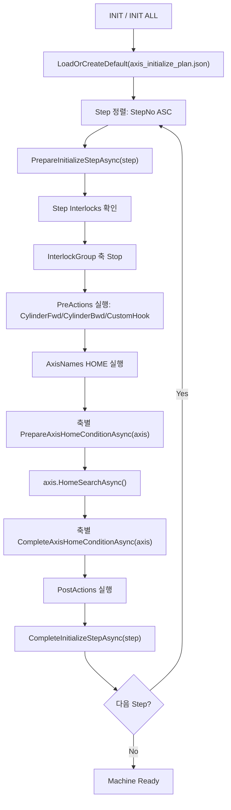

# CDT-320 Initialization Sequence

이 문서는 `MachineController.InitAsync()` / `InitializeAllAxesAsync()`에서 사용하는 자동 초기화 구조를 정리합니다.

## 실행 구조

## 기본 HOME 순서

| Step | GroupName | 대상 | 이유 |
|---:|---|---|---|
| 10 | PickerZ | Front/Rear Picker Z | Z 간섭을 먼저 제거합니다. |
| 10 | InputStageNeedleZ | NeedleZ, EjectPinZ | Needle 수직축을 먼저 안전화합니다. |
| 10 | OutputStageZ | GoodStage_StageZ, NgStage_StageZ | Output stage Y 이동 전 Z 간섭을 제거합니다. |
| 20 | PickerT | Front/Rear Picker T | Picker Z 이후 T축 HOME. |
| 20 | InputStageZ | ExpanderZ | Needle 수직축 이후 ExpanderZ HOME. |
| 30 | FrontPickerY | FrontPickerY -> Avoid | HOME 후 Avoid 위치로 이동합니다. |
| 40 | RearPickerY | RearPickerY -> Avoid | HOME 후 Avoid 위치로 이동합니다. |
| 40 | Vision | FrontSideVisionY, RearSideVisionY | Side vision Y축 HOME. |
| 40 | CylinderTemplate | Reticle 계열 | 기본 비활성. 방향 확인 후 사용. |
| 50 | InputFeederClamp | InputFeederClamp Bwd | InputFeederY HOME 전 Unclamp. |
| 60 | InputFeederLift | InputFeederLift Fwd | InputFeederY HOME 전 Up. |
| 701 | InputFeeder | FeederY | 70-1. Feeder/SharedRailX 조건 확인 후 HOME. |
| 702 | SharedRailX | CameraX, FrontPickerX, RearPickerX, OutputVisionX | 70-2. InputFeeder와 상관관계 확인 후 HOME. |
| 80 | InputCassette | InputLifterZ | FeederY 안전 위치 이후 카세트 Z HOME. |
| 80 | InputStage | StageY, StageT | HOME 후 StageY를 Avoid로 이동합니다. |
| 90 | InputStageNeedleX | NeedleBlockX | StageY Avoid 이동 이후 HOME. |
| 90 | OutputFeederClamp/Lift | OutputFeeder 실린더 | OutputFeederY HOME 전 Unclamp/Up. |
| 901 | OutputFeeder | OutputFeederY | 90-1. OutputFeeder/SharedRailX 조건 확인 후 HOME. |
| 902 | SharedRailXOutput | CameraX, FrontPickerX, RearPickerX, OutputVisionX | 90-2. 이미 HOME 된 X축은 같은 INIT 실행 안에서 skip. |
| 100-150 | Bin guide cylinders | NG/Good bin guide 계열 | 기본 비활성. 방향 확인 후 사용. |
| 160 | OutputStage | GoodStage_StageY, NgStage_StageY | Output feeder 상관관계 이후 Y축 HOME. |
| 170 | OutputCassette | OutputLifterZ | OutputFeederY 안전 위치 이후 카세트 Z HOME. |
| 200+ | Remaining | 기본 목록에 없는 등록 축 | 장비 트리에 등록된 추가 축 보존용. |
| 900 | CylinderTemplate | 실린더 템플릿 | 기본 비활성. 현장 안전 방향 확인 후 사용. |

## 기본 활성 실린더 액션

| Step | Phase | Cylinder | Command | 목적 |
|---:|---|---|---|---|
| 50 | PreActions | InputFeederClamp | CylinderBwd | InputFeederY HOME 전 Unclamp. |
| 60 | PreActions | InputFeederLift | CylinderFwd | InputFeederY HOME 전 Up. |
| 90 | PreActions | OutputFeederClamp | CylinderBwd | OutputFeederY HOME 전 Unclamp. |
| 90 | PreActions | OutputFeederLift | CylinderFwd | OutputFeederY HOME 전 Up. |

## 조건부 순서

엑셀의 `70-1/70-2`, `90-1/90-2`는 Feeder와 SharedRailX 위치 상관관계 때문에 분리되어 있습니다.

- InputFeederY가 Avoid가 아니면 InputFeederY HOME을 먼저 잡고, 이후 X축을 HOME/Avoid로 정리합니다.
- CameraX/FrontPickerX/RearPickerX가 InputStage 쪽 위험 위치에 있으면 X축을 먼저 HOME/Avoid로 정리한 뒤 InputFeederY HOME을 잡아야 합니다.
- OutputFeederY와 FrontPickerX/RearPickerX/OutputVisionX도 같은 방식으로 OutputStage 쪽 위험 위치를 확인해야 합니다.

이 판단은 `PrepareInputFeederHomeAsync`, `PrepareOutputFeederHomeAsync`, `PrepareSharedRailXAxisHomeAsync`에서 현장 기준을 채우도록 구조가 열려 있습니다.

## 실린더 템플릿

`axis_initialize_plan.json` 생성 시 `CylinderTemplate` step이 `Enabled=false`로 생성됩니다.
현장 안전 방향 확인 후 필요한 액션만 `Enabled=true`로 바꾸고 StepNo를 원하는 위치로 옮기면 됩니다.

대상 템플릿:

- `ReticleLift`
- `ReticleSideSlideFront`
- `ReticleSideSlideRear`
- `NGBinGuideLift`
- `NGBinGuideClampLift`
- `NGBinGuideClamp`
- `GoodBinGuideLift`
- `GoodBinGuideClampLift`
- `GoodBinGuideClamp`

## 축별 HOME 조건 훅

축 HOME 직전에 `PrepareAxisHomeConditionAsync(axis)`가 호출됩니다.
축 HOME 직후에는 `CompleteAxisHomeConditionAsync(axis)`가 호출됩니다.

현재 준비된 개별 함수:

| 함수 | 사용처 |
|---|---|
| `PrepareDefaultAxisHomeAsync` | 공통 기본 HOME 전 조건 |
| `CompleteDefaultAxisHomeAsync` | 공통 기본 HOME 후 조건 |
| `PrepareInputLifterZHomeAsync` | InputLifterZ HOME 전 조건 |
| `PrepareOutputLifterZHomeAsync` | OutputLifterZ HOME 전 조건 |
| `PrepareInputFeederYHomeByAxisAsync` | FeederY HOME 전 조건 |
| `PrepareOutputFeederYHomeByAxisAsync` | OutputFeederY HOME 전 조건 |
| `PrepareSharedRailXAxisHomeAsync` | CameraX/PickerX/OutputVisionX HOME 전 조건 |

각 함수 내부의 `TODO` 위치에 “어떤 축을 살짝 이동 후 HOME”, “어떤 실린더를 먼저 동작”, “센서 상태 확인” 같은 현장 조건을 채우면 됩니다.

## 현재 인터락 요약

| 대상 | HOME 인터락 핵심 |
|---|---|
| InputFeederY | InputVisionX Avoid, FrontPickerX Avoid, RearPickerX Avoid, Feeder Unclamp, Feeder Up, LifterZ 정지 |
| InputLifterZ | InputFeederY 정지 및 안전 위치 |
| OutputFeederY | Good/NG Stage Avoid, OutputVisionX Avoid, Feeder Unclamp, Feeder Up, OutputLifterZ 정지 |
| OutputLifterZ | OutputFeederY 정지 및 안전 위치 |
| SharedRailX | 같은 X rail 축 상호 간섭 확인 |
| PickerFront/Rear | 상대 PickerX, VisionX, 자체 Y/T/Z 이동 상태 확인 |
| InputStage | InputFeederY 안전 위치 및 자체 축 이동 상태 확인 |
| OutputStage | OutputFeederY/OutputLifterZ 정지, Good/NG 상호 Z Avoid 확인 |
| Vision | InputStage 및 Reticle 실린더 이동 상태 확인 |

## 파일 위치

- 초기화 플랜 모델: `D:\Source\QMC.CDT-320\Equipment\Initialization\AxisInitializePlan.cs`
- 초기화 실행부: `D:\Source\QMC.CDT-320\Equipment\MachineController.cs`
- 생성되는 설정 파일: `D:\CDT-320\Config\axis_initialize_plan.json`
