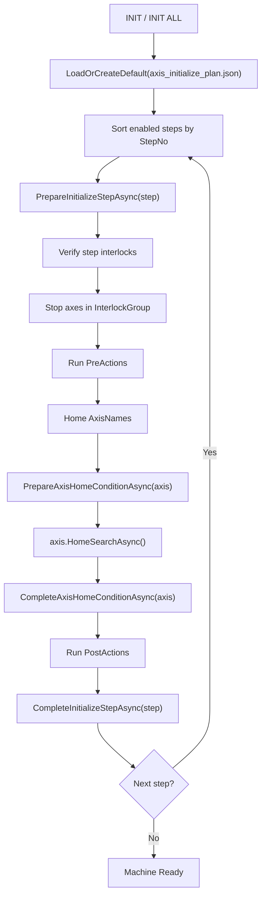

# CDT-320 Initialization Sequence

This document describes the default axis initialization plan used by `MachineController.InitAsync()` and `InitializeAllAxesAsync()`.

## Execution Flow

## Default Home Order

| Step | GroupName | Target | Reason |
|---:|---|---|---|
| 10 | PickerZ | Front/Rear Picker Z | Picker vertical clearance first. |
| 10 | InputStageNeedleZ | NeedleZ, EjectPinZ | Needle vertical axes home before planar axes. |
| 10 | OutputStageZ | GoodStage_StageZ | Output good stage Z only. NG stage has Y axis only. |
| 20 | PickerT | Front/Rear Picker T | Picker T axes home after Picker Z clearance. |
| 20 | InputStageZ | ExpanderZ | ExpanderZ home after needle vertical axes. |
| 30 | FrontPickerY | FrontPickerY -> Avoid | Home, then move to Avoid in axis post hook. |
| 40 | RearPickerY | RearPickerY -> Avoid | Home, then move to Avoid in axis post hook. |
| 40 | Vision | FrontSideVisionY, RearSideVisionY | Side vision Y axes home. |
| 40 | CylinderTemplate | Reticle cylinders | Disabled template actions. Enable only after field direction is confirmed. |
| 50 | InputFeederClamp | InputFeederClamp Bwd | InputFeederY home requires unclamp. |
| 60 | InputFeederLift | InputFeederLift Fwd | InputFeederY home requires feeder up. |
| 71 | InputFeeder | FeederY | InputFeederY relation check step. |
| 72 | InputVisionX | CameraX | Runs as part of the ordered 72->73->74 block. |
| 73 | FrontPickerX | FrontPickerX | Runs after InputVisionX. |
| 74 | RearPickerX | RearPickerX | Runs after FrontPickerX. |
| 80 | InputCassette | InputLifterZ | Input cassette lifter Z home after InputFeederY is safe. |
| 80 | InputStage | StageY, StageT | Home, then StageY moves to Avoid before NeedleBlockX. |
| 90 | InputStageNeedleX | NeedleBlockX | NeedleBlockX home after StageY avoid move. |
| 90 | OutputFeederClamp/Lift | OutputFeeder cylinders | OutputFeederY home requires unclamp and up. |
| 91 | OutputFeeder | OutputFeederY | OutputFeederY relation check step. |
| 92 | SharedRailXOutput | OutputVisionX | OutputVisionX homes with OutputFeederY relation check. |
| 100-150 | Bin guide cylinders | NG/Good bin guide cylinders | Disabled template actions. Enable only after field direction is confirmed. |
| 160 | OutputStage | GoodStage_StageY, NgStage_StageY | Output stage Y axes home after feeder relation and bin guide template steps. |
| 170 | OutputCassette | OutputLifterZ | Output cassette lifter Z home after OutputFeederY is safe. |
| 200+ | Remaining | Unlisted registered axes | Preserves registered axes not covered by known steps. |
| 900 | CylinderTemplate | Cylinder templates | Disabled template actions for field safety checks. |

## Conditional Order

Input side:

- Step 71 and the ordered block 72->73->74 are conditionally ordered by the InputFeeder/SharedRailX relation.
- If the shared rail side must clear first, the order is 72->73->74->71.
- Otherwise, the order is 71->72->73->74.
- Steps 72, 73, and 74 are never run in parallel and always keep that internal order.

Output side:

- Step 91 and step 92 are conditionally ordered by the OutputFeeder/OutputVisionX relation.
- OutputVisionX is no longer included in the input-side shared rail block.

## Default Cylinder Actions

| Step | Phase | Cylinder | Command | Purpose |
|---:|---|---|---|---|
| 50 | PreActions | InputFeederClamp | CylinderBwd | InputFeederY home requires unclamp. |
| 60 | PreActions | InputFeederLift | CylinderFwd | InputFeederY home requires feeder up. |
| 90 | PreActions | OutputFeederClamp | CylinderBwd | OutputFeederY home requires unclamp. |
| 90 | PreActions | OutputFeederLift | CylinderFwd | OutputFeederY home requires feeder up. |

## Key Files

- Initialization plan model: `D:\00.PROJECT\CDT-320\Source\CDT320Simulator\QMC.CDT-320\QMC.CDT-320\Equipment\Initialization\AxisInitializePlan.cs`
- Initialization execution: `D:\00.PROJECT\CDT-320\Source\CDT320Simulator\QMC.CDT-320\QMC.CDT-320\Equipment\MachineController.cs`
- Runtime plan file: `D:\CDT-320\Config\axis_initialize_plan.json`
