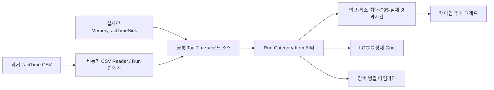

# LOGIC TIMECHART 그래프 개선 구현 계획서

- 작성일: 2026-07-19
- 기준 소스: `D:\Source\CDT-320_New`
- 대상 화면: 작업 정보 → LOGIC → TIMECHART
- 문서 상태: 구현 및 비장비 자동 검증 완료, Sim Auto 종단검증 대기
- 구현 원칙: 코드 구현 후 `TIMECHART_GRAPH_VERIFICATION_CHECKLIST.md`의 항목별 증거를 남겨 검증한다.

## 1. 목적

현재 TIMECHART는 장비 운전 중 생성되는 택타임 레코드를 시간축 막대로 표시하지만, 레코드가 많아지면 막대가 겹치고 정확한 소요시간과 병목 구간을 확인하기 어렵다. 또한 메모리에 남아 있는 현재 운전 데이터만 표시하여, 이전 운전 때 저장된 택타임 CSV를 화면에서 다시 열어 비교·분석할 수 없다.

이번 개선의 목적은 다음과 같다.

1. 실시간 운전 택타임을 보기 쉬운 그래프로 표시한다.
2. 특정 공정의 평균, 최소, 최대, P95와 시간별 변화를 정확하게 확인한다.
3. Input, FrontPicker, RearPicker, Output의 병렬 동작과 대기 구간을 같은 시간축에서 확인한다.
4. `D:\CDT-320\Log\TactTime\yyyy-MM-dd.csv`에 저장된 과거 운전 기록을 선택하여 동일한 그래프로 다시 표시한다.
5. 큰 이력 파일을 열어도 UI가 멈추지 않고, 취소와 진행상태 표시가 가능하도록 한다.

## 2. 구조적 결론

현재 데이터 수집과 CSV 저장 구조는 유지할 수 있다. 문제의 중심은 데이터 수집이 아니라 TIMECHART 화면의 데이터 소스가 실시간 메모리로 한정되어 있고, 그래프 표현과 통계 계산이 단순하다는 점이다.

따라서 시퀀스나 택타임 기록 코드를 광범위하게 바꾸지 않고 다음 세 계층을 추가·정리한다.

1. **데이터 소스 계층**
   - 실시간: 기존 `MemoryTactTimeSink` 스냅샷 사용
   - 이력: 기존 `CsvTactTimeSink` 형식과 호환되는 CSV Reader 추가
2. **분석 계층**
   - 실제 시간 범위, 평균, 최소, 최대, P95, 결과 건수 계산
   - 중첩 레코드 합산과 실제 운전 경과시간을 구분
3. **표현 계층**
   - 택타임 추이 그래프와 장비 타임라인 그래프를 분리
   - 확대/축소, 이동, 툴팁, 선택 연동, 범례 제공

## 3. 현재 코드 분석

### 3.1 현재 UI 경로

| 구분 | 현재 코드 | 현재 역할 | 확인된 한계 |
|---|---|---|---|
| LOGIC 페이지 | `QMC.CDT-320\Ui\Pages\WorkInfo\LogicPage.cs` | `LogicDetailPage` 호스팅 | 별도 문제 없음 |
| 상세 화면 | `QMC.CDT-320\Ui\Pages\WorkInfo\LogicDetailPage.cs` | 실시간 레코드 조회, 필터, Grid, 차트 그리기 | UI·필터·통계·그리기가 한 파일에 집중됨 |
| 화면 배치 | `LogicDetailPage.Designer.cs` | 필터, Grid, TIMECHART 패널 배치 | 과거 기록 열기, Run 선택, 차트 보기 전환 컨트롤 없음 |
| 실시간 조회 | `LogicDetailPage.LoadFilteredRecords()` | `MachineController.GetTactTimeSnapshot()` 조회 | 현재 메모리 스냅샷만 조회함 |
| 차트 | `LogicDetailPage.DrawChart()` | 고정 10등분 시간축에 막대 표시 | 툴팁·선택·확대/축소·스크롤·값 라벨이 없음 |
| 메모리 저장 | `MemoryTactTimeSink` | 최대 5,000개 레코드 보관 | 장시간 운전 전체 이력은 메모리에 남지 않음 |
| 파일 저장 | `CsvTactTimeSink` | 날짜별 CSV 저장 | 저장 기능만 있고 불러오기 기능이 없음 |

### 3.2 현재 그래프 정확도 문제

1. 같은 Unit의 여러 레코드가 같은 Y 위치에 그려져 서로 가려질 수 있다.
2. 전체 운전 구간을 화면 폭에 강제로 맞추므로 짧은 공정은 2픽셀 막대로만 보인다.
3. 막대에 공정명과 시간값이 없어서 Grid와 육안으로 대조해야 한다.
4. `lblSummary`의 `total`은 모든 레코드의 `ElapsedMs`를 합산한다. Unit 안에 Process, Process 안에 Step이 포함되므로 실제 운전 경과시간이 아니라 중복 합계가 될 수 있다.
5. 평균값만 일부 합성하고 최소, 최대, P95와 편차를 표시하지 않는다.
6. 현재 파일에 깨진 한글 문자열이 존재하므로 TIMECHART 수정 범위의 운영자 문구를 정상 한글로 복구해야 한다.
7. 예외를 기록하지 않는 빈 `catch`가 많아 차트 갱신 또는 필터 실패 원인을 확인하기 어렵다.

### 3.3 과거 기록 현황

- 저장 위치: `D:\CDT-320\Log\TactTime`
- 파일 단위: 날짜별 `yyyy-MM-dd.csv`
- 현재 CSV 열: 19개
  - `When, RunId, ParentId, CorrelationId, EquipmentId, ProjectName, LotId, Mode, UnitName, SequenceName, ProcessName, StepName, Category, StartedAt, EndedAt, ElapsedMs, Result, AlarmCode, Detail`
- 한 날짜 파일 안에 여러 번의 Auto Run이 서로 다른 `RunId`로 저장된다.
- 실제 파일 크기는 수 KB부터 200MB 이상까지 존재하므로 UI 스레드에서 전체 파일을 한 번에 읽으면 안 된다.

## 4. 구현 범위

### 4.1 포함 범위

1. 실시간/과거기록 데이터 소스 전환
2. 날짜별 CSV 파일 선택
3. 선택 파일의 Run 목록 조회 및 Run 선택
4. 선택 Run의 기존 Category/Item 필터 적용
5. 장비 타임라인 그래프
6. 택타임 추이 그래프
7. 평균, 최소, 최대, P95, 실제 경과시간, 실패/정지 건수 표시
8. 차트 선택과 Grid 선택 연동
9. 확대/축소, 좌우 이동, 초기화, 툴팁, 범례
10. 대용량 파일 비동기 로딩, 진행률, 취소, 오류 안내
11. 수정 범위의 깨진 한글 문구 복구 및 실패 로그 보강

### 4.2 제외 범위

1. 시퀀스의 택타임 측정 위치를 전면 재설계하는 작업
2. 실제 장비 모션, 인터락, IO, Vision 통신 변경
3. CSV 저장 열 이름 또는 순서를 바꾸는 호환성 파괴 변경
4. 외부 그래프 NuGet 패키지 도입
5. 여러 날짜 파일을 동시에 합쳐 장기간 통계 보고서를 만드는 기능
6. Recipe 목표 택타임이 정의되지 않은 상태에서 임의의 목표선이나 합격 기준을 만드는 기능

## 5. 사용자 화면 설계

### 5.1 상단 데이터 소스 영역

기존 Category/Item 필터 앞 또는 별도 첫 줄에 다음 컨트롤을 배치한다.

| 컨트롤 | 표시 예 | 역할 |
|---|---|---|
| 데이터 소스 | `LIVE` / `HISTORY` | 실시간과 과거 기록 상태를 명확히 표시 |
| 과거 기록 열기 | `지난 기록 불러오기` | TactTime CSV 선택 |
| Run 선택 | `21:36:20 ~ 21:38:27 / Auto / Y482CB1` | 파일 안의 여러 Run 중 하나 선택 |
| 실시간 복귀 | `실시간 보기` | 메모리 스냅샷으로 복귀 |
| 로딩 취소 | `취소` | 대용량 파일 스캔 중 취소 |
| 파일 정보 | 날짜, 파일크기, Run 수 | 현재 이력 데이터 출처 표시 |

이력 보기에서는 Auto Refresh가 이력 데이터를 실시간 데이터로 덮어쓰지 않도록 정지한다. 실시간 보기로 복귀하면 기존 1초 갱신 정책을 다시 적용한다.

### 5.2 TIMECHART 내부 보기

TIMECHART 탭 안에서 다음 두 보기를 전환한다.

#### A. 택타임 추이

- X축: 발생 순번 또는 실제 종료 시각
- Y축: 소요시간, 기본 단위 `s`, 짧은 값은 `ms`
- 데이터: 선택한 Item의 개별 택타임
- 보조선: 평균과 P95
- 포인트 선택 시 표시:
  - 발생 시각
  - Unit / Sequence / Process / Step
  - 정확한 `ElapsedMs`
  - Result / AlarmCode / Detail
- 급격히 증가한 값은 색상 또는 마커로 구분하되, 임의의 불량 판정은 하지 않는다.

#### B. 장비 타임라인

- 공통 X축: 실제 `StartedAt`부터 `EndedAt`
- 기본 Lane 순서:
  1. Machine/Run
  2. Input
  3. FrontPicker
  4. RearPicker
  5. Output
  6. Vision 및 기타 Unit
- Category별 색상:
  - Run/Unit: 청색 계열
  - Process: 녹색 계열
  - Vision: 보라색 계열
  - Motion: 주황색 계열
  - Wait/Resource: 회색·하늘색 계열
  - Failed: 적색
  - Stopped/Canceled: 황색
- 같은 Lane에서 시간이 겹치는 레코드는 하위 행으로 배치하여 막대가 서로 가려지지 않게 한다.

### 5.3 공통 시각 요소

1. 상단 KPI 카드
   - 실제 표시 구간
   - 레코드 수
   - 평균
   - P95
   - 최대
   - Failed / Stopped 건수
2. 마우스 툴팁
3. 선택 막대 강조 테두리
4. Category/Result 범례
5. 마우스 휠 확대/축소
6. 수평 스크롤 또는 드래그 이동
7. `전체 보기` 버튼
8. 좁은 막대는 라벨을 생략하고 툴팁으로 정확한 값을 제공
9. 100%, 125%, 150% DPI에서 글자와 축이 겹치지 않도록 동적 크기 계산

## 6. 데이터 불러오기 설계

### 6.1 CSV Reader

`QMC.Common\Diagnostics\TactTime`에 읽기 전용 Reader를 추가한다.

예정 책임은 다음과 같다.

1. UTF-8 BOM CSV 읽기
2. 큰따옴표, 쉼표, 큰따옴표 이스케이프, 필드 내 줄바꿈 처리
3. 헤더 이름 기준 열 매핑
4. `DateTimeStyles.RoundtripKind` 기준 시각 변환
5. Category/Result 안전 변환
6. 누락된 선택 열은 기본값 처리
7. 필수값이 잘못된 행은 전체 로딩을 중단하지 않고 건너뛴 행 수와 이유를 반환
8. 현재 기록 중인 파일도 `FileShare.ReadWrite`로 읽되, 마지막 미완성 행은 경고 후 제외
9. `CancellationToken`과 파일 위치 기반 진행률 제공

### 6.2 Run 인덱스와 선택 로딩

200MB 이상의 파일을 통째로 UI 메모리에 적재하지 않도록 두 단계로 처리한다.

1. **1차 스캔**
   - `RunId`, 시작, 종료, Mode, LotId, 레코드 수만 집계
   - Run 선택 목록 생성
2. **2차 스캔**
   - 사용자가 선택한 RunId만 읽음
   - 선택한 Category/Item 통계와 표시 레코드 생성

필터 변경 시 무조건 전체 파일을 반복해서 읽지 않도록 마지막 선택 Run을 제한된 캐시로 보관한다. 캐시 한도를 넘는 경우 Grid와 차트 표시 개수를 제한하되, 통계는 선택 Run 전체를 기준으로 계산하고 화면에 제한 사실을 표시한다.

### 6.3 정확도 규칙

1. **실제 경과시간** = `max(EndedAt) - min(StartedAt)`
2. **개별 택타임** = CSV 또는 메모리의 `ElapsedMs`
3. `ElapsedMs`가 없거나 음수이면 유효한 시작/종료 시각으로 재계산하고 경고 건수를 표시
4. 평균, 최소, 최대, P95는 같은 Item/Process 집합 안에서만 계산
5. P95는 정렬 후 nearest-rank 방식으로 계산하고 표기 규칙을 코드와 문서에 동일하게 유지
6. Unit/Process/Step의 중첩 소요시간 합계는 실제 운전시간으로 표시하지 않음
7. 실패·정지 레코드는 그래프에서 제외하지 않고 결과 색상으로 표시

## 7. 실제 코드 변경

| 파일 | 구현 내용 |
|---|---|
| `QMC.Common\Diagnostics\TactTime\TactTimeCsvReader.cs` | CSV 파서, Run 인덱스, 선택 Run 로딩 DTO 추가 |
| `QMC.Common\QMC.Common.csproj` | 신규 Reader 파일 Compile 등록 |
| `QMC.CDT-320\Ui\Pages\WorkInfo\TactTimeChartControl.cs` | 더블 버퍼링 기반 추이/타임라인 그래프, 선택·툴팁·확대/이동 구현 |
| `QMC.CDT-320\QMC.CDT-320.csproj` | 신규 Chart Control 파일 Compile 등록 |
| `LogicDetailPage.Designer.cs` | 데이터 소스, 파일 열기, Run 선택, 차트 보기 전환, 진행상태 컨트롤 배치 |
| `LogicDetailPage.cs` | 실시간/이력 전환, 비동기 로딩, 필터, 통계, Grid/Chart 연동 정리 |

Reader와 Chart Control의 책임을 위 표 수준으로 제한했다. Designer에는 컨트롤 생성·배치·이벤트 연결만 두고, 파일 읽기와 통계 계산을 넣지 않았다. 기존 LOGIC 페이지가 한국어 운용 문구와 영문 필터명을 함께 사용하는 구조이므로 이번 범위의 정적 문구도 동일한 화면 정책을 유지하고, 동적 상태 문구는 정상 한국어로 작성했다.

## 8. 구현 순서

### 단계 1. 기준 상태 확보

1. 현재 TIMECHART 화면과 필터 동작 캡처
2. 실시간 레코드 수와 CSV 저장 레코드 샘플 대조
3. 기존 dirty 파일과 변경 대상 겹침 재확인

### 단계 2. CSV Reader 구현

1. 기존 19열 형식 파싱
2. Run 인덱스 생성
3. 선택 Run 로딩
4. 취소, 진행률, 잘못된 행 보고
5. 소형 검증 CSV로 파서 검증

### 단계 3. 차트 컨트롤 구현

1. 공통 축/범례/툴팁/선택
2. 택타임 추이
3. 장비 타임라인과 겹침 방지
4. 확대/축소/스크롤/전체 보기
5. 대량 레코드 화면 범위 렌더링 최적화

### 단계 4. LOGIC 화면 통합

1. LIVE/HISTORY 상태 전환
2. 과거 파일과 Run 선택
3. 기존 Category/Item 필터 연동
4. Grid/차트 선택 동기화
5. 통계와 상태 문구 표시
6. 수정 범위의 깨진 한글 복구

### 단계 5. 체크리스트 검증

1. 정적 검사 및 안전한 별도 OutDir 빌드
2. 실시간 기능 회귀 검증
3. 과거 CSV 불러오기 정확도 검증
4. 그래프 수치와 원본 CSV 대조
5. 14MB급과 200MB급 실제 파일 성능 검증
6. Sim Auto Run 생성 기록을 실시간 표시 후 CSV로 다시 열어 동일성 검증

## 9. 성능 및 안전 기준

1. 파일 스캔과 파싱은 UI 스레드에서 실행하지 않는다.
2. 로딩 시작 후 진행상태를 표시하고 사용자가 취소할 수 있어야 한다.
3. 차트는 현재 보이는 시간 범위의 레코드만 그린다.
4. 추이 데이터 축소가 필요하면 픽셀 구간별 최소/최대값을 보존하여 순간 택타임 상승이 사라지지 않게 한다.
5. Grid 표시 제한이 적용되면 전체 통계 건수와 표시 건수를 구분한다.
6. 과거 CSV는 읽기 전용으로 열며 수정·이동·삭제하지 않는다.
7. 이 기능은 장비 축, IO, 시퀀스 시작/정지 명령을 호출하지 않는다.
8. 이력 로딩 실패는 UI 메시지와 Main 로그에 파일명, 진행 위치, 오류를 남긴다.

## 10. 완료 기준

다음 조건을 모두 만족해야 구현 완료로 판정한다.

1. 실시간 TIMECHART가 기존처럼 자동 갱신된다.
2. 과거 날짜 CSV를 열고 파일 안의 Run을 선택할 수 있다.
3. 선택 Run이 택타임 추이와 장비 타임라인에 모두 표시된다.
4. 그래프에서 선택한 값이 원본 `StartedAt`, `EndedAt`, `ElapsedMs`와 일치한다.
5. 실제 경과시간과 중첩 레코드 합계가 혼동되지 않는다.
6. 확대/축소, 이동, 전체 보기, 툴팁, 범례가 동작한다.
7. 200MB급 파일 스캔 중 UI가 멈추지 않고 취소할 수 있다.
8. 깨진 한글이 없고, 실패 원인을 확인할 수 있는 로그가 남는다.
9. 별도 OutDir Build와 `git diff --check`를 통과한다.
10. 검증 체크리스트의 필수 항목이 모두 PASS이고, 미검증 항목은 사유와 현장 검증 방법이 기록되어 있다.

## 11. 예상 위험과 대응

| 위험 | 영향 | 대응 |
|---|---|---|
| 날짜 파일이 매우 큼 | UI 멈춤, 메모리 증가 | 2단계 스트리밍, 비동기 로딩, 취소, 표시 제한 |
| 한 파일에 여러 Run 포함 | 서로 다른 운전 데이터 혼합 | RunId 인덱스 및 명시적 Run 선택 |
| 현재 기록 중인 CSV의 마지막 행이 미완성 | 파싱 실패 | FileShare.ReadWrite, 마지막 미완성 행 제외 및 경고 |
| 중첩 레코드 합산 | 실제 운전시간 과대 표시 | 실제 시간 범위와 항목별 통계를 분리 |
| 너무 많은 막대가 같은 Lane에 겹침 | 병목 구간 식별 불가 | 간격 배치, 하위 행, 화면 범위 렌더링 |
| 큰 파일에서 필터 변경이 느림 | 사용성 저하 | 선택 Run 캐시와 통계/표시 데이터 분리 |
| WinForms GDI 리소스 누수 | 장시간 사용 시 화면 문제 | Pen/Brush/Font 수명 관리, 캐시된 리소스 Dispose 검증 |
| 기존 UI 필터 회귀 | 현재 사용 기능 손상 | 기존 Category/Item/Auto Refresh 회귀 체크 필수 |

## 12. 구현 및 검증 결과

### 12.1 구현 결과

1. LIVE/HISTORY 전환, 날짜 CSV 선택, Run 목록과 최근 Run 기본 선택을 구현했다.
2. CSV Reader는 UTF-8 BOM, quoted comma/quote, 필드 내 줄바꿈, 누락 선택 열, 미완성 마지막 행, `FileShare.ReadWrite`, 취소와 진행률을 처리한다.
3. 택타임 추이와 장비 타임라인을 전용 더블 버퍼링 Control로 분리했다.
4. 휠 확대/축소, 드래그 이동, 전체 보기, 툴팁, 막대/점 선택, Grid 양방향 선택 연동을 구현했다.
5. 실제 경과시간은 `max(EndedAt)-min(StartedAt)`으로 계산하며, 전체 필터의 통계·추이에서는 중첩되는 Run/Unit 컨테이너를 제외하고 안내 문구를 표시한다.
6. 타임라인은 같은 Lane·Category의 중첩 구간을 별도 하위 행에 배치하고, 대량 표시는 최대 15,000개로 단순화하되 실패/정지/선택 레코드는 보존한다.
7. 추이 그래프는 픽셀 버킷별 최소/최대점을 보존하고, 빈도가 높은 시리즈 외에 최대 스파이크와 비정상 결과 시리즈를 우선 포함한다.
8. KPI 요약을 독립 행으로 분리해 기록 수, Grid 표시 수, 구간, 평균, 최소, P95, 최대, 실패·정지, 혼합 통계 안내를 전체 폭에 표시한다.
9. 선택 Run 안에서 반복되는 Run/Unit/Sequence/Process 문자열을 공유해 대용량 HISTORY의 메모리 사용량을 줄였다.

### 12.2 측정 결과

| 항목 | 결과 |
|---|---|
| 최신 파일 | `D:\CDT-320\Log\TactTime\2026-07-18.csv`, 13.75MB, 39,499행, 10 Run |
| 최신 파일 인덱스 | 439ms |
| 최신 Run 로드 | 38,981건, 469ms |
| 대용량 파일 | `2026-07-10.csv`, 198.8MB, 614,559행, 52 Run |
| 대용량 인덱스 | 5,780ms |
| 최대 Run 로드 | 288,539건, 6,257ms, 관리 메모리 약 108.2MB 증가 |
| 취소 응답 | 동기 39ms, 비동기 41ms |
| 최신 Run 렌더 | 타임라인 295ms, 추이 281ms |
| 반복 열기 | 14MB 파일 10회 후 메모리 +0.18MB, 파일 핸들 -1 |
| 최신 Run 독립 통계 | 구간 1,911,239.769ms, 상세 평균 405.391ms, P95 3,529ms, 최대 16,793ms, Canceled 5건 |
| 빌드 | Debug/Any CPU 별도 OutDir 성공, 기존 CS0162 경고 4건만 존재 |

### 12.3 남은 종단검증

전체 Handler 실행은 설정에 따라 실제 축·IO·Vision 연결을 시도할 수 있어 이번 비장비 검증에서는 실행하지 않았다. Sim이 확실히 선택된 환경에서 Auto Run을 1회 수행한 뒤 체크리스트 `E2E-01~05`, LIVE 1초 갱신, 페이지 재진입 Timer, DPI 125/150%, 장시간 GDI 항목을 최종 확인해야 한다.
