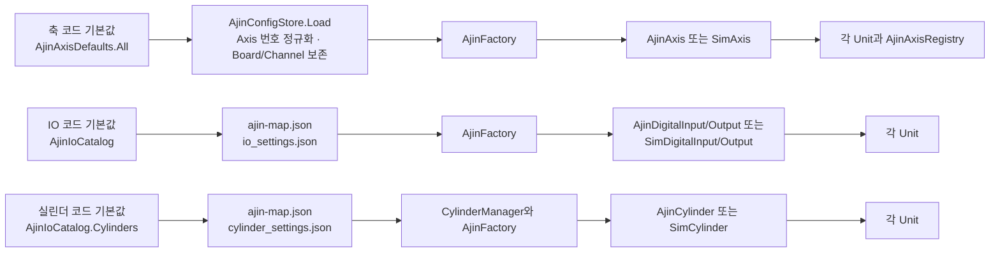

# 축·IO·실린더 정의 코드 탐색표

> 이 문서는 코드 탐색을 돕는 참고 자료이며 안전 사양서나 실행 절차서가 아니다.
> 실제 동작·매핑·인터락 판단은 현재 소스 코드, 실행 시 설정, 실장비 상태를 함께 확인한다.
> 문서와 코드가 다르면 `AGENTS.md`와 현재 소스 코드를 우선한다.

현재 소스에서 확인되는 코드 기본값은 축 37개, DI 92개, DO 72개, 실린더 13개다. 이 숫자는 **코드 카탈로그의 현재 항목 수**이며 실장비에서 최종 적용되는 주소를 뜻하지 않는다.

## 가장 먼저 볼 위치

| 찾으려는 내용 | 기준 파일 | 핵심 타입·멤버 | 의미 |
|---|---|---|---|
| 축 이름과 코드 기본값 | [AjinConfig.cs](../../QMC.CDT-320/Equipment/Ajin/AjinConfig.cs) | `AxisDefault`, `AjinAxisDefaults.All` | 축 이름, 기본 Axis 번호, Board/Channel, Unit 이름, Stroke, Brake, 단위, 속도, Home 방향, Legacy 이름 |
| DI·DO 이름과 코드 기본값 | [AjinIoCatalog.cs](../../QMC.CDT-320/Equipment/Ajin/AjinIoCatalog.cs) | `DioDefault`, `DigitalInputs`, `DigitalOutputs` | IO 이름, Module, Bit, NC와 선언 순서 기반 `No` |
| 실린더 구성 기본값 | [AjinIoCatalog.cs](../../QMC.CDT-320/Equipment/Ajin/AjinIoCatalog.cs) | `CylinderDefault`, `Cylinders`, `CylinderRefs` | 실린더 이름과 전진·후진 출력 및 센서 조합 |
| 축·IO·실린더 저장 매핑 | [AjinConfig.cs](../../QMC.CDT-320/Equipment/Ajin/AjinConfig.cs) | `AxisMap`, `DioMap`, `CylMap`, `AjinConfigStore` | `D:\CDT-320\Config\ajin-map.json` 로드·저장 모델. 축의 `Axis` 값은 로드 시 코드 기본 번호로 정규화 |
| 축 세부 운전 설정 | [MotionAxisStore.cs](../../QMC.Common/Motion/MotionAxisStore.cs) | `MotionAxisDefinition`, `MotionAxisStore` | 실행 폴더의 `Config\motion_axes.json`에 저장되는 Setup·Config·Recipe |
| IO Simulation 설정 | [IoSettingsStore.cs](../../QMC.CDT-320/Equipment/Ajin/IoSettingsStore.cs) | `IoSettings`, `IoPortSettings` | `D:\CDT-320\Config\io_settings.json`의 이름별 Simulation 모드 |
| 실린더 동작 설정 | [CylinderSettingsStore.cs](../../QMC.CDT-320/Equipment/Ajin/CylinderSettingsStore.cs) | `CylinderItemSettings`, `Apply` | `D:\CDT-320\Config\cylinder_settings.json`의 솔레노이드·센서·Timeout·피드백 정착시간 설정. 저장된 `IsSimulationMode`는 현재 `Apply`의 모드 결정에 직접 사용되지 않음 |
| 런타임 객체 생성 | [AjinFactory.cs](../../QMC.CDT-320/Equipment/Ajin/AjinFactory.cs) | `RegisterConfiguredAxes`, `CreateAxis`, `CreateDigitalInput`, `CreateDigitalOutput`, `CreateCylinder` | 설정을 읽어 실제 `Ajin*` 또는 `Sim*` 객체를 만드는 경계 |
| 공유 실린더 조회 | [CylinderManager.cs](../../QMC.CDT-320/Equipment/Ajin/CylinderManager.cs) | `Initialize`, `Get`, `ApplyMappings`, `ApplySettings` | 이름별 단일 실린더 인스턴스를 생성·보관하고 Unit에 제공 |
| 축 목록 조회 | [AjinAxisRegistry.cs](../../QMC.CDT-320/Equipment/Ajin/AjinAxisRegistry.cs) | `GetOrderedAxes` | Machine 축과 Factory 등록 축을 합쳐 설정 Axis 번호순으로 제공 |
| Unit의 논리 축 이름 | [UnitDefined.cs](../../QMC.CDT-320/Equipment/Unit/Common/UnitDefined.cs) | `PickerAxis`, `VisionAxis` 등 축 enum | 시퀀스·Unit 내부에서 실제 사용하는 논리 키. enum 숫자는 물리 Axis 번호가 아님 |
| 공통 등록 Base | [UnitDefined.cs](../../QMC.CDT-320/Equipment/Unit/Common/UnitDefined.cs) | `UnitDefined<TAxis>`, `RegisterAxis/Input/Output` | 재사용 가능한 등록 형식. 현재 컴파일 대상 Unit 중 이를 상속하는 타입은 없음 |
| 장비 조립과 기동 | [CDT320Machine.cs](../../QMC.CDT-320/Equipment/CDT320Machine.cs), [Form1.cs](../../QMC.CDT-320/Form1.cs) | `CDT320_Machine`, `Form1_Load` | Unit 생성과 설정 로드, 보드 Open, 주소 검증, IO Scan 시작 순서 |

### 정의에서 Unit까지



`AjinIoCatalog`는 누락된 IO·실린더 설정을 채우는 **코드 기본값**이고, 현장에 이미 `ajin-map.json`이 있으면 같은 이름의 저장 주소가 적용될 수 있다. 축은 다르다. `AjinConfigStore.EnsureDefaultAxes`가 로드할 때 `AxisMap.Axis`를 `AjinAxisDefaults.All`의 번호로 다시 지정하고 저장 파일에서는 `BoardNo`와 `ChannelNo`만 보존한다.

## 축 탐색표

| 장비 영역 | 코드 고정 Axis 번호 | `AjinAxisDefaults.All`의 축 이름 | 실제 Unit 연결 위치 |
|---|---:|---|---|
| Input Cassette | 0 | `InputLifterZ` | [InputCassetteUnit.cs](../../QMC.CDT-320/Equipment/Unit/InputCassetteUnit.cs) |
| Input Feeder | 1 | `InputFeederY` | [InputFeederUnit.cs](../../QMC.CDT-320/Equipment/Unit/InputFeederUnit.cs) |
| Input Stage | 2~8 | `InputStageY`, `InputStageT`, `InputExpandingZ`, `InputVisionX`, `NeedleX`, `NeedleZ`, `EjectPinZ` | [InputStageUnit.cs](../../QMC.CDT-320/Equipment/Unit/InputStageUnit.cs) |
| Front Picker | 9~18 | `FrontPickerX`, `FrontPickerY`, `FrontPickerT0~T3`, `FrontPickerZ0~Z3` | [PickerFrontUnit.cs](../../QMC.CDT-320/Equipment/Unit/PickerFrontUnit.cs) |
| Side Vision | 19~20 | `FrontSideVisionY0`, `RearSideVisionY0` | [VisionUnit.cs](../../QMC.CDT-320/Equipment/Unit/VisionUnit.cs) |
| Rear Picker | 21~30 | `RearPickerX`, `RearPickerY`, `RearPickerT0~T3`, `RearPickerZ0~Z3` | [PickerRearUnit.cs](../../QMC.CDT-320/Equipment/Unit/PickerRearUnit.cs) |
| Output Stage | 31~34 | `OutputGoodStageY`, `OutputGoodStageZ`, `OutputNGStageY`, `OutputVisionX` | [OutputStageUnit.cs](../../QMC.CDT-320/Equipment/Unit/OutputStageUnit.cs) |
| Output Feeder | 35 | `OutputFeederY` | [OutputFeederUnit.cs](../../QMC.CDT-320/Equipment/Unit/OutputFeederUnit.cs) |
| Output Cassette | 36 | `OutputLifterZ` | [OutputCassetteUnit.cs](../../QMC.CDT-320/Equipment/Unit/OutputCassetteUnit.cs) |

`FeederY` 같은 이름은 기존 설정과의 호환을 위한 `LegacyKeys`일 수 있다. 축 이름이나 별칭은 단순 표시 문자열이 아니라 저장 설정과 연결되는 계약일 수 있으므로 임의로 바꾸지 않는다.

`UnitDefined.cs`의 `PickerAxis`, `VisionAxis` 같은 enum 값은 Unit 내부의 **논리 키**다. enum의 정수값을 실제 AJIN Axis 번호로 해석하지 않는다. 실제 AJIN 명령에 쓰는 Axis 번호의 기준은 `AjinAxisDefaults.All`이며, `AjinConfig.Axes`도 로드 시 그 번호로 정규화된다.

현재 `AjinAxis`의 모션 명령은 `AxisNo`를 사용한다. `AxisMap.BoardNo`와 `ChannelNo`는 설정·표시 정보로 유지되지만, 이 두 값만 바꿔 실제 명령 축이 변경된다고 가정하면 안 된다.

## IO 탐색표

모든 신호의 단일 코드 목록은 [AjinIoCatalog.cs](../../QMC.CDT-320/Equipment/Ajin/AjinIoCatalog.cs)의 `DigitalInputs`와 `DigitalOutputs`다. 자주 쓰는 신호는 `AjinIoCatalog.Inputs`와 `AjinIoCatalog.Outputs`의 형식화된 접근자로 Unit에 전달된다.

| 구분 | 기본 Module | 묶여 있는 장비 영역 |
|---|---:|---|
| DI | 0 | 조작반, Utility, Door, Input Cassette, Input Feeder |
| DI | 1 | Input Feeder, Input Stage, Reticle, Needle, Picker, Good Bin |
| DI | 2 | Output Stage, Output Feeder, Output Cassette, Avoid 센서 |
| DO | 3 | 조작반, Input Feeder, Reticle, Good Bin |
| DO | 4 | NG Bin, Output Feeder, Vision, Needle, Front Picker |
| DO | 5 | Rear Picker |

Module 표는 탐색용 그룹이다. 주소 문제를 추적할 때는 다음 네 지점을 순서대로 함께 본다.

1. `AjinIoCatalog`의 코드 기본값
2. `D:\CDT-320\Config\ajin-map.json`의 같은 이름 매핑
3. 해당 Unit이 `AjinFactory.CreateDigitalInput/Output`으로 실제 연결하는 지점
4. `Machine.LoadSettings()`에서 뒤이어 적용할 수 있는 `EquipmentData\Setup\<StorageKey>.json`

`DigitalInputs`와 `DigitalOutputs`의 선언 순서로 `No`가 결정된다. 기존 항목을 정렬하거나 중간 이동하면 번호 계약이 달라질 수 있으므로 가독성 정리 목적으로 순서를 바꾸지 않는다.

## 실린더 탐색표

| 장비 영역 | `AjinIoCatalog.Cylinders`의 이름 | 실제 Unit 연결 위치 |
|---|---|---|
| Input Feeder | `InputFeederLift`, `InputFeederClamp` | [InputFeederUnit.cs](../../QMC.CDT-320/Equipment/Unit/InputFeederUnit.cs) |
| Vision·Reticle | `ReticleLift`, `ReticleSideSlideFront`, `ReticleSideSlideRear` | [VisionUnit.cs](../../QMC.CDT-320/Equipment/Unit/VisionUnit.cs) |
| Output Stage NG | `NGBinGuideLift`, `NGBinGuideClampLift`, `NGBinGuideClamp` | [OutputStageUnit.cs](../../QMC.CDT-320/Equipment/Unit/OutputStageUnit.cs) |
| Output Stage Good | `GoodBinGuideLift`, `GoodBinGuideClampLift`, `GoodBinGuideClamp` | [OutputStageUnit.cs](../../QMC.CDT-320/Equipment/Unit/OutputStageUnit.cs) |
| Output Feeder | `OutputFeederLift`, `OutputFeederClamp` | [OutputFeederUnit.cs](../../QMC.CDT-320/Equipment/Unit/OutputFeederUnit.cs) |

실린더 하나는 이름만으로 동작하지 않는다. `CylinderDefault`에 연결된 FWD/BWD 출력, FWD/BWD 센서, 편솔·양솔 설정, 센서 사용 여부, 방향별 Timeout을 한 묶음으로 확인한다. Unit은 새 인스턴스를 직접 만들기보다 `CylinderManager.Get(...)`으로 공유 인스턴스를 받는다.

`CylinderItemSettings.IsSimulationMode`는 JSON에 직렬화되고 UI에서 조회·저장할 수 있지만, 현재 `CylinderSettingsStore.Apply()`는 이 필드값으로 모드를 정하지 않는다. 실제 실린더 모드는 애플리케이션의 Simulation·DryRun·UseAjin·BypassHardware 상태와 보드 준비 여부를 바탕으로 [IoRuntimePolicy.cs](../../QMC.CDT-320/Equipment/Ajin/IoRuntimePolicy.cs) 및 `AjinFactory.ApplyCylinder*` 경로에서 결정된다.

## 실제 기동 시 적용 순서

기동 진입점은 [Form1.cs](../../QMC.CDT-320/Form1.cs)의 `Form1_Load`다. 탐색 관점에서의 주요 순서는 다음과 같다.

```text
AjinConfigStore.Load()                  축·IO·실린더 물리 매핑
  → AjinSystem.Open()                   실제 보드를 사용할 때
  → IoSettingsStore.Load()              IO Simulation 설정
  → CylinderManager.Initialize()        실린더 매핑과 동작 설정
  → AjinFactory.RegisterConfiguredAxes()
  → new CDT320_Machine()                각 Unit에 축·IO·실린더 연결
  → Machine.LoadSettings()              저장된 장비 설정 적용
  → AjinFactory.VerifyCatalogAddresses("Startup")
  → ApplyRuntimeMode()
  → AjinIoScanService.Start()
```

직접 연결된 DI·DO는 `Machine.LoadSettings()`에서 `EquipmentData\Setup`의 저장값 영향을 받을 수 있다. 시작 로그의 `VerifyCatalogAddresses` 경고까지 확인해야 코드 카탈로그와 런타임 주소의 차이를 찾을 수 있다.

## 항목 하나를 추적하는 순서

### 축

1. `AjinAxisDefaults.All`에서 축 이름과 기본 번호를 찾는다.
2. `LegacyKeys`가 있으면 이전 설정 이름도 함께 찾는다.
3. `ajin-map.json`의 `Axes`에서는 Board/Channel 저장값을 확인한다. `Axis` 번호는 로드 시 코드 기본 번호로 정규화된다.
4. 해당 Unit의 `AjinFactory.CreateAxis(...)` 호출을 찾는다.
5. `motion_axes.json`에 저장된 Limit·Home·속도 등 세부 설정을 확인한다.
6. UI 목록 문제라면 마지막에 `AjinAxisRegistry.GetOrderedAxes(...)`를 확인한다.

### IO

1. `DigitalInputs` 또는 `DigitalOutputs`에서 정확한 이름과 기본 Module·Bit·NC를 찾는다.
2. `Inputs` 또는 `Outputs`에 형식화된 접근자가 있는지 찾는다.
3. `ajin-map.json`의 같은 이름과 해당 Unit의 Factory 호출을 함께 확인한다.
4. Simulation 문제라면 `io_settings.json`을 확인한다.
5. 시작 로그의 주소 불일치 경고와 `EquipmentData\Setup` 저장값을 확인한다.

### 실린더

1. 실린더가 참조하는 DI·DO 네 항목을 먼저 찾는다.
2. `Cylinders`에서 전진·후진 출력과 센서 조합을 확인한다.
3. `ajin-map.json`의 `Cylinders` 매핑을 확인한다.
4. `CylinderManager.Initialize/Get`과 실제 Unit 연결을 확인한다.
5. `cylinder_settings.json`의 솔레노이드·센서·Timeout·피드백 정착시간을 확인한다.
6. Simulation·DryRun 문제는 저장된 실린더 `IsSimulationMode`가 아니라 애플리케이션 모드와 보드 준비 상태, `ApplyCylinderSimulation/ApplyCylinderDryRun` 경로를 확인한다.

빠르게 찾을 때는 저장소 루트에서 다음처럼 검색한다.

```powershell
rg -n "InputStageY|AjinAxisDefaults" QMC.CDT-320/Equipment
rg -n "신호이름|DigitalInputs|DigitalOutputs" QMC.CDT-320/Equipment
rg -n "실린더이름|CylinderRefs|CylinderManager.Get" QMC.CDT-320
```

## 혼동하기 쉬운 경계

- `AjinAxisRegistry`는 정의 원본이 아니라 UI·설정용 조회기다.
- Unit 축 enum은 논리 이름이며 물리 축 번호가 아니다. `UnitDefined<TAxis>`는 현재 활성 Unit의 공통 Base가 아니다.
- IO·실린더 주소의 코드 기본값과 실장비 적용값은 같다고 보장할 수 없다. 반면 축 `Axis` 번호는 로드 시 코드 기본값으로 다시 정규화된다.
- 축 번호, IO 이름·순서·주소, 실린더 IO 조합, 설정 키와 Legacy 이름은 영속 데이터 또는 배선 계약일 수 있다.
- 카탈로그에서 항목을 찾았다는 사실은 모션 허가를 뜻하지 않는다. 실제 이동은 시퀀스 자원, Unit 상태, [MotionGuardService.cs](../../QMC.CDT-320/Equipment/Interlocks/Common/MotionGuardService.cs)와 등록된 인터락을 모두 통과해야 한다.
- [WaferStageUnit.cs](../../QMC.CDT-320/Equipment/Unit/WaferStageUnit.cs)와 [BinStageUnit.cs](../../QMC.CDT-320/Equipment/Unit/BinStageUnit.cs)는 소스에는 있지만 현재 프로젝트에 컴파일 포함되지 않는다. 현재 동작 기준은 `CDT320_Machine`이 실제 생성하는 Unit이다.
- 프로젝트는 `.cs` 파일을 명시적으로 포함한다. 이후 정의 클래스를 새로 추가할 경우 [QMC.CDT-320.csproj](../../QMC.CDT-320/QMC.CDT-320.csproj) 등록 여부도 확인해야 한다.
