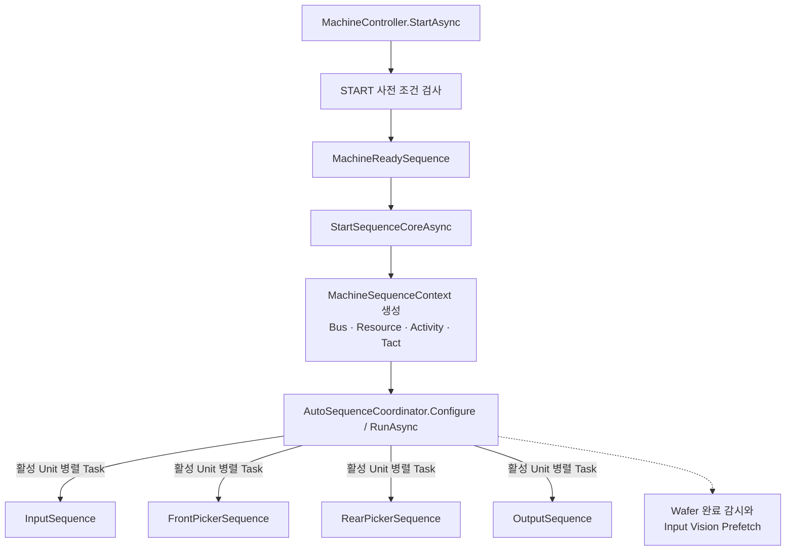
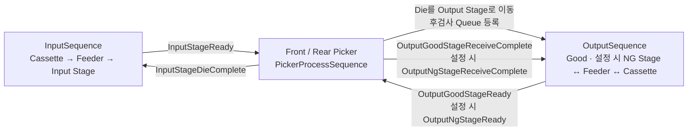
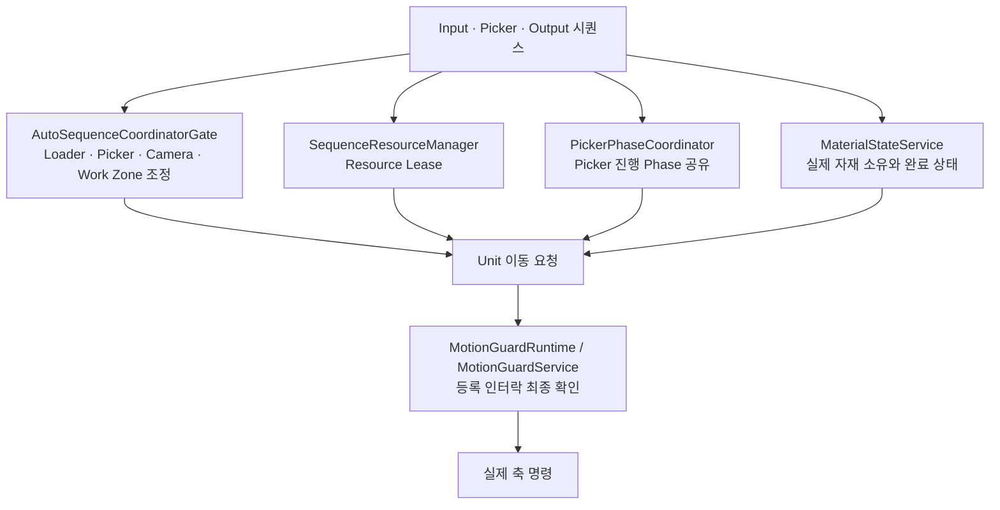
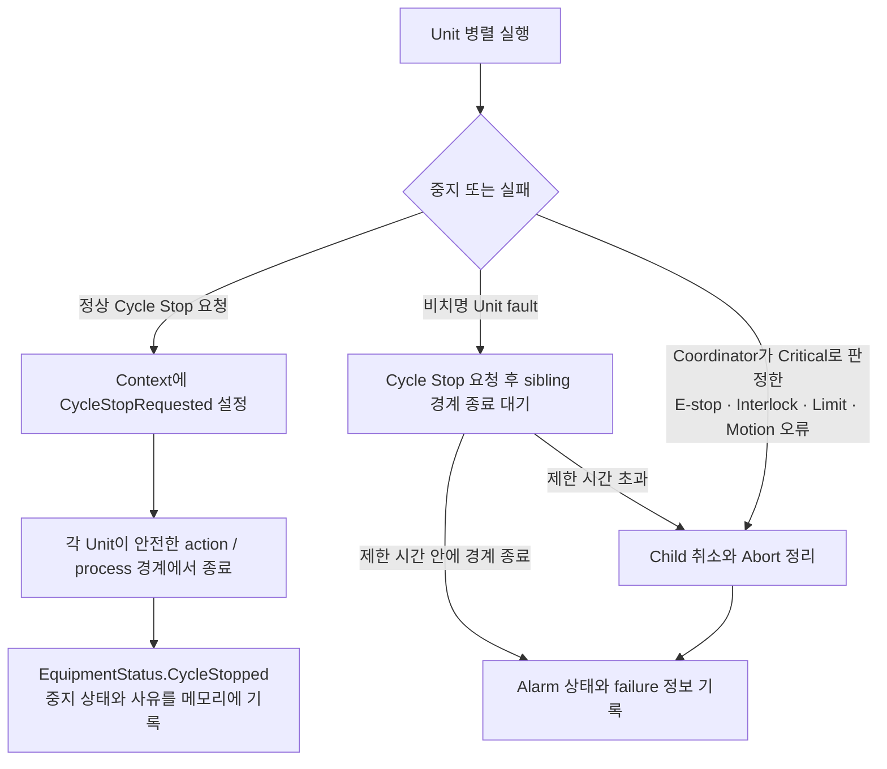

# 자동 시컨스 전체 흐름도

> 이 문서는 코드 탐색을 돕는 참고 자료이며 안전 사양서나 실행 절차서가 아니다.
> 실제 동작·매핑·인터락 판단은 현재 소스 코드, 실행 시 설정, 실장비 상태를 함께 확인한다.
> 문서와 코드가 다르면 `AGENTS.md`와 현재 소스 코드를 우선한다.

## 핵심 요약

`AutoSequenceCoordinator → Input → Picker → Output`은 **자재와 신호가 인계되는 논리 순서**다. 실제 제어는 Coordinator가 활성화된 Input, Front Picker, Rear Picker, Output Unit 루프를 거의 동시에 시작하고, 각 루프가 Signal·Material 상태·Lease·인터락을 기다리며 협업한다.

따라서 아래 화살표를 메서드의 직렬 호출이나 임의 Step 실행 순서로 해석하면 안 된다.

## 실제 제어 시작 구조



[MachineController.cs](../../QMC.CDT-320/Equipment/MachineController.cs)의 일반 생산 `StartAsync`는 Alarm·중복 실행·초기화·Recipe·Input 자재 출처·Lot 등을 먼저 확인하고 `RunReadySequenceBeforeStartAsync`를 거친다. 이후 `StartSequenceCoreAsync`가 [MachineSequenceContext.cs](../../QMC.CDT-320/Sequencing/Common/MachineSequenceContext.cs)와 [AutoSequenceCoordinator.cs](../../QMC.CDT-320/Sequencing/AutoSequenceCoordinator.cs)를 만들고 네 Unit factory를 등록한다.

[SequenceRunOptions.cs](../../QMC.CDT-320/Sequencing/Common/SequenceRunOptions.cs)의 옵션에 따라 일부 Unit만 활성화될 수 있다. 일반 Process Auto에서는 Input Loader, Front Picker, Rear Picker, Output Unloader가 등록 대상이며 실제 `RunAsync`에서 활성 Unit들이 병렬로 실행된다.

## 자재와 핵심 신호 흐름



물리적인 정상 자재 경로는 다음과 같다.

```mermaid
flowchart LR
    IC["Input Cassette"] --> IF["Input Feeder"]
    IF --> IS["Input Stage<br/>Align · Die Map · Review"]
    IS --> PP["Front / Rear Picker<br/>PickUp · Inspection · Place"]
    PP --> OS["Good 또는 설정 시 NG Output Stage"]
    OC["Output Cassette"] -->|"빈 Bin 공급"| OF["Output Feeder"]
    OF -->|"Stage 투입"| OS
    OS -->|"완료 Bin 회수"| OF
    OF -->|"원 Slot로 복귀"| OC
    IS -.->|"Wafer의 Die Pick 완료"| IF
    IF -.->|"원 Slot로 Wafer 복귀"| IC
```



NG 경로는 항상 활성인 고정 분기가 아니다. `ResultRoutingMode`와 `UseNgCassette` 설정에 따라 Good 강제 또는 검사 결과별 Good·NG routing을 사용한다.

## 영역별 코드 진입점

| 영역 | 주 파일 | 읽을 핵심 지점 | 역할 |
|---|---|---|---|
| START·Coordinator 생성 | [MachineController.cs](../../QMC.CDT-320/Equipment/MachineController.cs) | `StartAsync`, `RunReadySequenceBeforeStartAsync`, `StartSequenceCoreAsync` | 사전 조건, Ready, Context 생성, Unit 등록, 운전 상태 전환 |
| Machine Ready | [MachineReadySequence.cs](../../QMC.CDT-320/Sequencing/MachineReadySequence.cs) | `RunAsync` | 자동 생산 전에 필요한 Ready 동작 수행 |
| 병렬 실행·장애 전파 | [AutoSequenceCoordinator.cs](../../QMC.CDT-320/Sequencing/AutoSequenceCoordinator.cs) | `Configure`, `RunAsync`, `WaitAllOrCancelOnFirstFailureAsync` | 활성 Unit 병렬 시작, 완료 대기, Cycle Stop·Alarm·취소 조정 |
| 공통 Unit 실행 틀 | [UnitSequenceBase.cs](../../QMC.CDT-320/Sequencing/Common/UnitSequenceBase.cs) | `RunAsync`, `AcquireResourceForRunAsync` | Activity, 오류 전파, 공통 Resource Lease |
| Input 상위 흐름 | [InputSequence.cs](../../QMC.CDT-320/Sequencing/InputSequence.cs) | `ExecuteAutoAsync`, `ExecuteInputAutoCycleAsync`, Ready 신호 publish, DieComplete 대기, 복구 판단 | Cassette·Feeder·Stage·Align·Map·Review·Wafer 회수 통합 |
| Input Load | [InputSequence.Steps.Load.cs](../../QMC.CDT-320/Sequencing/InputSequence.Steps.Load.cs) | Mapping과 Load 단계 | Cassette slot 결정과 Stage 공급 |
| Input Align·Review | [InputSequence.Steps.Align.cs](../../QMC.CDT-320/Sequencing/InputSequence.Steps.Align.cs), [InputSequence.Steps.Review.cs](../../QMC.CDT-320/Sequencing/InputSequence.Steps.Review.cs) | Align, DieMap, Review 승인 | Pickup 가능한 Input Stage 상태 확정 |
| Picker 상위 루프 | [FrontPickerSequence.cs](../../QMC.CDT-320/Sequencing/FrontPickerSequence.cs), [RearPickerSequence.cs](../../QMC.CDT-320/Sequencing/RearPickerSequence.cs) | Work 대기, Loader active 확인, Process 생성 | 각 Picker가 실행 가능한 target을 기다리고 공정 시작 |
| Picker 공정 | [PickerProcessSequence.cs](../../QMC.CDT-320/Sequencing/PickerProcessSequence.cs), [PickerProcessStep.cs](../../QMC.CDT-320/Sequencing/PickerProcessStep.cs) | Step dispatch와 실제 상태 기반 재개 | Input Camera Mark, PickUp, Bottom·Side 검사, Place 통합 |
| Pickup | [PickerPickUpSequence.cs](../../QMC.CDT-320/Sequencing/Picker/PickerPickUpSequence.cs), [PickerPickUpSequence.MotionResolvers.cs](../../QMC.CDT-320/Sequencing/Picker/PickerPickUpSequence.MotionResolvers.cs) | Pick target, material 이동, 마지막 Die 완료 | Input Stage의 Die를 Picker 보유 상태로 전환 |
| Place | [PickerPlaceSequence.cs](../../QMC.CDT-320/Sequencing/Picker/PickerPlaceSequence.cs), [PickerPlaceSequence.OutputStageReady.cs](../../QMC.CDT-320/Sequencing/Picker/PickerPlaceSequence.OutputStageReady.cs), [PickerPlaceSequence.Completion.cs](../../QMC.CDT-320/Sequencing/Picker/PickerPlaceSequence.Completion.cs) | Output Stage Ready 대기, Place, ReceiveComplete | Die를 Good·NG Stage로 전달하고 완료 신호 발행 |
| Output 상위 흐름 | [OutputSequence.cs](../../QMC.CDT-320/Sequencing/OutputSequence.cs), [OutputSequence.ActionPlanner.cs](../../QMC.CDT-320/Sequencing/OutputSequence.ActionPlanner.cs) | Stage ready, 다음 Action 계획, 완료 Bin 저장 | Good·NG Stage 공급·회수와 Feeder·Cassette 물류 통합 |
| Output 안전·하위 호출 | [OutputSequence.Safety.cs](../../QMC.CDT-320/Sequencing/OutputSequence.Safety.cs), [OutputSequence.UnitCalls.cs](../../QMC.CDT-320/Sequencing/OutputSequence.UnitCalls.cs) | Loader gate와 하위 Unit sequence | Picker와 충돌하지 않게 Output 물류 실행 |

## Input → Picker → Output 상세 순서

### 1. Input

1. Input Cassette를 Mapping하고 작업할 slot을 정한다.
2. Input Cassette → Input Feeder → Input Stage로 Wafer를 공급한다.
3. Feeder를 복귀시킨 뒤 Align, Die Mapping, 필요 시 Review 승인을 수행한다.
4. `MaterialStateService.IsInputStageFinishComplete`까지 확인한 후 `InputStageReady`를 발행한다.
5. Picker들이 Die를 처리하는 동안 `InputStageDieComplete`를 기다린다.
6. Die 처리가 끝난 Wafer를 Input Stage → Input Feeder → 원 Cassette slot로 되돌린다.
7. 다음 Wafer를 위해 cycle signal을 정리한다.

Input의 Cassette·Feeder·Stage 하위 동작은 [InputCassette](../../QMC.CDT-320/Sequencing/InputCassette), [InputFeeder](../../QMC.CDT-320/Sequencing/InputFeeder), [InputStage](../../QMC.CDT-320/Sequencing/InputStage) 폴더에 나뉘어 있다.

### 2. Front·Rear Picker

Front와 Rear 루프는 각자 다음 조건을 기다린다.

- Picker가 이미 Die를 보유해 검사·Place를 재개해야 하거나, `InputStageReady`와 자기 side가 처리할 target이 함께 있어야 한다.
- `InputLoaderActive`와 `OutputLoaderActive`가 해제되어야 한다.
- 자기 Picker resource와 필요한 work zone을 얻어야 한다.
- 상대 Picker·Camera·Loader와의 중앙 gate 조건을 만족해야 한다.

조건을 만족하면 각 wrapper가 `PickerProcessSequence`를 만들고 다음 논리 Step을 진행한다.

```text
CheckUnit
  → RunInputCameraMarkInspection
  → RunPickUp
  → RunBottomInspection
  → RunSideInspection
  → RunPlace
  → Complete
```

이 목록은 dispatch를 찾기 위한 논리 단계다. 실제 Auto 경로는 Bottom+Side 통합 검사 분기, 이미 완료된 검사 결과, 자재 보유 상태 등에 따라 일부 단계를 합치거나 건너뛸 수 있다. 시작 시 저장된 Step만 믿지 않고 Picker가 실제로 Die를 보유했는지와 검사 결과를 확인해 재개 지점을 정한다.

### 3. Output

1. 설정상 사용하는 Good 및 필요 시 NG Stage가 실제 수신 가능한지 Material 상태를 확인한다.
2. 가능한 side에 `OutputGoodStageReady` 또는 설정상 사용하는 `OutputNgStageReady`를 발행한다.
3. Picker Place가 해당 side의 Ready를 기다린 뒤 Die를 Stage로 넘긴다.
4. 마지막 Place와 Picker Avoid, 후검사 Queue 완료 조건을 확인한 뒤 side별 `ReceiveComplete`를 발행한다.
5. Output Action Planner가 완료 Stage 저장, 점유 Feeder 재개, 설정상 필요한 Good·NG Bin 공급, 완료 대기 중 다음 동작을 다시 선택한다.
6. 완료된 Bin은 Output Stage → Output Feeder → 해당 Output Cassette slot 순서로 저장된다.

## 핵심 Signal 표

| Signal | 주 설정 측 | 주 확인 측 | 의미 |
|---|---|---|---|
| `InputLoaderActive` | Input loader lease·gate | Front·Rear Picker | Input Cassette·Feeder·Stage 물류 중 Picker 신규 공정 진입 차단 |
| `OutputLoaderActive` | Output loader lease·gate | Front·Rear Picker | Output Stage·Feeder·Cassette 교체 중 Picker 신규 공정 진입 차단 |
| `InputStageReady` | Input | Front·Rear Picker | Align·Map·Review와 Stage finish 조건을 통과해 Pickup 가능 |
| `InputStageDieComplete` | Picker와 복구 보조 경로 | Input | Wafer 회수 절차로 넘어가기 위한 handoff. 실제 Loader 이동 전 Picker empty·Avoid·Stopped gate를 다시 검증 |
| `OutputGoodStageReady` | Output | Picker Place | Good Stage가 Die를 받을 수 있음 |
| `OutputNgStageReady` | Output | Picker Place | NG routing을 사용할 때 NG Stage가 Die를 받을 수 있음 |
| `OutputGoodStageReceiveComplete` | Picker Place | Output Action Planner | Good Stage의 현재 수신 단위가 완료됨 |
| `OutputNgStageReceiveComplete` | Picker Place | Output Action Planner | NG routing을 사용할 때 NG Stage의 현재 수신 단위가 완료됨 |
| `CycleStopRequested` | MachineSequenceContext flag와 Bus mirror | 모든 Unit의 안전 경계 | 새 작업을 확장하지 않고 현재 안전 경계에서 Cycle Stop |

`InputWaferLoaded`, `InputStageDieMapped`, `InputStageFinishComplete`는 Input ready 상태를 설명하는 상태·진단 신호다. `OutputStageReady`는 Good·NG 중 하나라도 가능한지를 나타내는 집계 신호다. 현재 코드에서 이 네 신호를 직접 소비하는 `Bus.IsSet` 또는 `WaitAsync` 호출은 없으며, 실제 Picker 제어는 `InputStageReady`, side별 Output Ready와 `MaterialStateService` 상태를 다시 확인한다.

신호 저장과 대기는 [SequenceSignalBus.cs](../../QMC.CDT-320/Sequencing/Common/SequenceSignalBus.cs)에서, 자재의 실제 소유 위치와 완료 조건은 [MaterialStateService.cs](../../QMC.CDT-320/Equipment/Materials/MaterialStateService.cs)에서 확인한다. Signal Bus는 순간 pulse가 아니라 `Reset` 전까지 Set 상태가 유지되는 latch다. Signal 하나만 Set되어 있다고 자재 이동 조건이 모두 충족된 것은 아니다.

`CycleStopRequested`도 Bus에 상태가 반영되지만 실제 중지 판단 기준은 `MachineSequenceContext.IsCycleStopRequested` 플래그다.

## 병렬 실행의 안전 경계



이 도표는 안전 계층의 역할 관계를 나타낸다. 모든 이동이 네 계층을 항상 동일한 순서로 직접 호출한다는 뜻은 아니다. Picker Phase와 work zone처럼 특정 Auto 경로에만 적용되는 계층도 있으므로 장치와 동작별 실제 호출 코드를 확인한다.

| 안전 계층 | 코드 | 담당 범위 |
|---|---|---|
| 중앙 Coordinator gate | [AutoSequenceCoordinatorGate.cs](../../QMC.CDT-320/Sequencing/Common/AutoSequenceCoordinatorGate.cs) | Loader와 Picker 시작, Camera와 Input·Bottom·Output work zone 경합 조정 |
| Resource lease | [SequenceResourceManager.cs](../../QMC.CDT-320/Sequencing/Common/SequenceResourceManager.cs), [SequenceResourceLease.cs](../../QMC.CDT-320/Sequencing/Common/SequenceResourceLease.cs) | 공유 자원의 동시 소유 방지 |
| Picker phase | [PickerPhaseCoordinator.cs](../../QMC.CDT-320/Sequencing/Common/PickerPhaseCoordinator.cs) | Front·Rear Picker의 현재 논리 공정 공유 |
| Material 상태 | [MaterialStateService.cs](../../QMC.CDT-320/Equipment/Materials/MaterialStateService.cs) | Wafer·Die·Bin의 실제 위치와 소유권 판단 |
| Motion guard | [MotionGuardRuntime.cs](../../QMC.CDT-320/Equipment/Interlocks/Common/MotionGuardRuntime.cs), [MotionGuardService.cs](../../QMC.CDT-320/Equipment/Interlocks/Common/MotionGuardService.cs) | 이동 요청 시점의 등록 인터락 검증 |

Picker 공정의 논리 work zone은 PickUp=`Input`, Bottom·Side 검사=`Bottom`, Place=`Output`으로 대응한다. 같은 zone을 상대 Picker나 Camera가 사용 중이면 중앙 gate가 진입을 보류한다. 이 조정은 MotionGuard를 대체하지 않는다.

## Stop·Alarm·Resume 흐름



- Cycle Stop은 모든 코드 위치에서 즉시 축을 끊는 개념이 아니다. 각 Unit은 `StopIfCycleStopRequested` 같은 정의된 경계에서 멈춘다.
- Picker가 Die를 들고 있는 경우에는 Alarm이 아닌 정상 Cycle Stop에서 Place와 필요한 후처리까지 마무리하는 drain 경로가 있을 수 있다.
- Coordinator가 Critical로 판정한 오류는 child를 취소하고 Abort 정리를 시도한다. 비치명 오류는 먼저 Cycle Stop 경계 종료를 요청하되 제한 시간을 넘기면 취소로 전환한다. 제한 시간 안에 정리돼도 원래 fault를 다시 전달하므로 최종 상태는 Alarm이다.
- Resume은 저장된 Step 번호만 재실행하지 않는다. Input Stage·Feeder의 Wafer 위치, Picker의 Die 보유와 검사 결과, Output Stage·Feeder 상태를 다시 보고 다음 동작을 결정한다.
- [SequenceResumeStore.cs](../../QMC.CDT-320/Sequencing/Common/SequenceResumeStore.cs)와 [SequenceFailureStore.cs](../../QMC.CDT-320/Sequencing/Common/SequenceFailureStore.cs)는 프로세스 메모리 안의 상태다. 디스크 영속 저장소가 아니며, Auto Cycle Stop의 상위 resume step은 빈 값으로 기록될 수 있으므로 실제 재개 위치는 Material과 runtime 상태로 다시 판단한다.

## 읽을 때 지켜야 할 원칙

- Coordinator의 네 화살표는 병렬 Task 시작이다. `InputSequence`가 끝난 후 Picker가 시작되는 구조가 아니다.
- Signal은 인계 조건의 일부다. 항상 Material 상태와 Gate·Lease·인터락 조건을 함께 본다.
- 흐름도를 근거로 하위 Step을 직접 호출하거나 Guard를 우회하거나 이동 순서를 바꾸지 않는다.
- 정상 경로만 보고 Stop·Alarm·Resume 코드를 삭제하거나 합치지 않는다. 실장비 안전과 복구 계약이 숨어 있을 수 있다.
- 더 세부적인 기존 분석은 [SEQUENCE_MAP.md](SEQUENCE_MAP.md)와 [SEQUENCE_SAFETY_ANALYSIS.md](SEQUENCE_SAFETY_ANALYSIS.md)를 참고하되, 서로 다르면 현재 소스를 우선한다.
