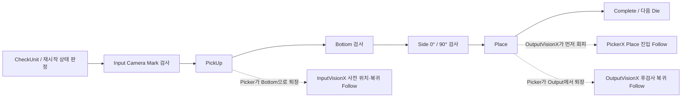
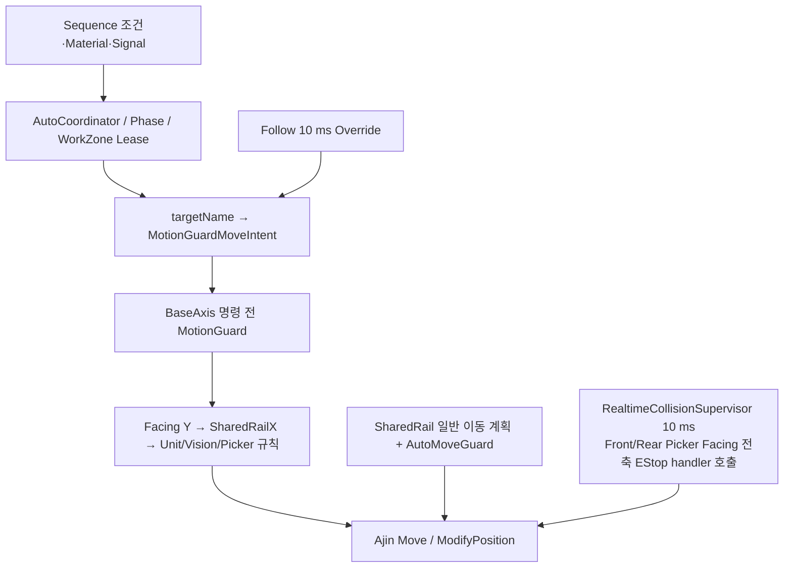

# Picker–Vision Follow / PickUp–Inspection–Place 안전 탐색 가이드

> 기준일: 2026-08-03
>
> 대상 소스: `D:\Source\CDT-320_New`
>
> 이 문서는 코드 탐색과 변경 전 위험 검토를 돕는 참고 자료다. 안전 사양서·실장비 승인서·시운전 절차서를 대신하지 않는다.

실제 동작 판단은 현재 소스, 실행 시 로드된 설정, 축의 Actual/Command 상태, 로그와 실장비 상태를 함께 확인해야 한다. 문서와 코드가 다르면 [AGENTS.md](../../AGENTS.md)와 현재 소스를 우선한다. **빌드 성공만으로 충돌 안전이나 실장비 정상 동작을 증명할 수 없다.**

함께 보면 좋은 문서:

- [자동 시컨스 전체 흐름도](../architecture/auto-sequence-flow.md)
- [축·IO·실린더 정의 코드 탐색표](../architecture/equipment-definition-code-map.md)

## 1. 가장 중요한 결론

1. Picker와 Input/Output Vision X의 Follow는 하드웨어 전자기어가 아니다. 선행축 위치를 읽고 후행축에 최초 절대이동 1회와 위치 Override를 반복 발행하는 **소프트웨어 Follow**다.
2. PickUp 진입에서는 `InputVisionX → PickerX`, Place 진입에서는 `OutputVisionX → PickerX` 순으로 Vision이 선행한다.
3. Picker 퇴장과 카메라 복귀가 겹칠 때는 방향이 반대다. `PickerX → InputVisionX` 또는 `PickerX → OutputVisionX`로 Picker가 선행한다.
4. Follow의 안전성은 하나의 인터락에만 의존하지 않는다. Phase/WorkZone Lease, `targetName` 이동 의도, MotionGuard 규칙, SharedRailX 페어 간격, 축 알람·리밋, Front/Rear Picker 실시간 감시가 서로 다른 범위를 담당한다.
5. `RealtimeCollisionSupervisor`는 Front/Rear Picker 대향 위험을 감시한다. **Vision X와 Picker X 사이의 SharedRail 간격을 대신 감시하는 장치가 아니다.**
6. `PickerZone=...`, `InspectionContinuous`, `PickUpZHold=...`, `From=...`, `To=...`, 정확한 `PickerPhase=InspectionZHold`는 인터락이 파싱하는 안전 계약이다. 다른 `PickerPhase` 값과 `PickerProcess`는 진단용 메타데이터일 수 있으므로 소비 여부를 구분해 추적한다.
7. Follow 산식·방향·간격·폴백 순서와 검사 결과 배리어를 단순화하면 정상 동작 중에도 카메라–Picker 접근, Z/Y 중첩 이동 또는 잘못된 Place가 발생할 수 있다.

## 2. 한 사이클 흐름



상위 흐름은 [PickerProcessSequence.cs](../../QMC.CDT-320/Sequencing/PickerProcessSequence.cs)의 `PickerProcessStep` dispatch가 결정한다. Bottom과 Side는 현재 통합 pipeline을 사용할 수 있으며, child 검사 완료 시 PickerX/Y를 Avoid로 되돌리지 않고 Side 종료 위치에서 Place로 이어지는 경로가 있다.

### 2.1 재시작과 보유 자재

재시작은 무조건 처음부터 시작하지 않는다.

- Picker가 비어 있으면 Input Camera 또는 PickUp 경로로 돌아간다.
- Bottom·Side 최종 결과까지 있는 Die를 보유하면 Place로 직접 이어질 수 있다.
- 검사 상태가 부분 완료이거나 불명확하면 Bottom 재검사·드레인 경로를 선택한다.
- OutputStage 교체 handoff 중에는 phase/work-zone을 해제하고 Picker process resource를 반환해 Loader가 획득할 수 있게 하지만, 보유 Die, cursor, 지연된 검사 결과 상태는 같은 sequence 인스턴스에 유지한다.
- Auto CycleStop도 활성 child 또는 Picker가 보유한 InputTarget Die가 있으면 즉시 공정 중단이 아니라 안전 배출 경계까지 드레인할 수 있다. Alarm 활성 시에는 이 드레인을 허용하지 않는다.

`Start`, `Resume`, `CycleStop`, `Alarm`은 같은 의미가 아니다. 특히 CycleStop 요청을 축의 즉시 EStop으로 해석하면 안 된다.

## 3. PickUp → Inspection → Place 조건

### 3.1 PickUp 진입

PickUp은 대략 다음 조건을 함께 확인한다.

- 해당 Picker side와 head가 사용 가능함
- `InputStageReady`, Wafer 존재, Input 공정 완료 상태
- Pick 가능한 Die와 예약 소유권
- Input Camera 검사 허가와 필요한 검사 완료
- InputStageArea 및 Input 작업영역 Lease
- 반대 Picker의 작업영역·대향 상태
- Picker 작업 반경과 X/Y/Z/T 자세
- Input Stage, Vision X, Needle 관련 이동 가능 상태
- Vacuum/Flow와 Material 상태

Auto Conti PickUp에서는 PickerY Avoid 단계를 의도적으로 생략할 수 있다. 이 경로는 “검사 생략”이 아니라 Facing, SharedRailX, Z 상태, WorkZone과 후속 명령 검증을 통과한다는 전제로 만들어진 중첩 경로다. 기준 파일은 [PickerPickUpSequence.ContinuousChecks.cs](../../QMC.CDT-320/Sequencing/Picker/PickerPickUpSequence.ContinuousChecks.cs)와 [PickerPickUpSequence.EntryMotion.cs](../../QMC.CDT-320/Sequencing/Picker/PickerPickUpSequence.EntryMotion.cs)다.

`PickUpZHold={pickerNo}`는 특정 PickerZ가 Avoid로 상승 중일 때 다음 X/Y 이동을 제한적으로 허용하는 계약이다. 단순히 “Z 검사 무시”가 아니며 Auto·Conti·Input zone·지정 Picker 번호 등 관련 토큰이 함께 맞아야 한다.

### 3.2 Bottom·Side 검사

통합 검사 흐름의 핵심은 다음과 같다.

1. 검사 진입 전 Flow와 자재 보유 상태를 확인한다.
2. InspectionArea와 상대 Picker 상태를 확인한다.
3. Bottom 검사 후 Side 0°/90° 검사를 수행한다.
4. EPD 완료와 최종 판정 결과 수신은 다른 시점일 수 있다.
5. 통합 child 완료 경계에서는 모든 PickerZ Avoid와 pending T0 복귀를 보장하지만 PickerX/Y는 Side 종료 위치에 남을 수 있다.

Place에는 두 개의 결과 배리어가 연결된다.

| 배리어 | 기다리는 시점 | 의미 |
|---|---|---|
| `WaitBottomFinalBeforePlaceMoveAsync` | OutputStage/Place XY 또는 Bottom 보정 이동 전 | Bottom FINAL과 Place 보정값 확정 |
| `WaitInspectionResultsBeforePlaceDownAsync` | PickerZ의 최종 Place 접촉 하강 직전 | Bottom+Side FINAL과 Material Good/NG 반영 완료 |

따라서 “Bottom/Side EPD가 끝났다”를 “모든 검사 판정이 끝났다”로 바꾸어 읽거나 두 배리어를 하나로 합치면 안 된다. 연결 지점은 [PickerProcessSequence.cs](../../QMC.CDT-320/Sequencing/PickerProcessSequence.cs)의 `RunPlaceAsync`다.

### 3.3 Place와 Material 전이

Place 시퀀스는 OutputStage Ready/Receive 조건, Output 작업영역 Lease, OutputVisionX 회피와 Picker 자세를 확인하고 검사 결과 callback을 단계별 gate에 연결한다. 모든 FINAL을 진입 시점에 한꺼번에 기다리는 구조는 아니다. Conti PrePlace Z 이동은 FINAL gate보다 먼저 실행될 수 있지만, **제품과 접촉하는 최종 PlaceZ 하강 전에는** Bottom+Side FINAL 배리어를 통과해야 한다.

제품 release 후 Material 데이터가 Picker에서 OutputStage로 이동하는 기준은 다음 동작의 완료다.

- Vacuum OFF settle
- 설정된 경우 Blow와 Blow delay
- Place release dwell
- 일반 경로의 PickerZ full Avoid 완료, 또는 Conti 경로의 승인된 Near-Avoid 이탈 확인

Conti 조기 진행에서는 잔여 Z 상승이 pending Task로 유지되고 후속 안전 경계에서 합류한다. 따라서 Material 전이 시점의 Z 상태를 모든 경로에서 “full Avoid 도착 완료”라고 표현해도 안 되고, 반대로 잔여 상승 Task 합류를 제거해도 안 된다.

[PickerPlaceSequence.PlaceDown.cs](../../QMC.CDT-320/Sequencing/Picker/PickerPlaceSequence.PlaceDown.cs)의 현재 Material 전이 경로에는 제품 분리를 별도로 확인하는 Flow OFF 센서 검증이 없다. 이를 “Flow OFF 확인 후 Material 이동”이라고 문서화하면 안 된다.

## 4. Picker–Vision Follow 호출 지도

| 시나리오 | 선행축 → 후행축 | 활성 조건·목적 | 핵심 코드 |
|---|---|---|---|
| PickUp 진입 | `InputVisionX → PickerX` | InputVision 회피와 Picker Input 진입 중첩 | [PickerPickUpSequence.VisionRetreat.cs](../../QMC.CDT-320/Sequencing/Picker/PickerPickUpSequence.VisionRetreat.cs) `MovePickerXEntryByVisionFollowOrFallbackAsync`, `TryFollowPickerXBehindInputVisionRetreatAsync` |
| PickUp 후 Input 사전 위치 | `PickerX → InputVisionX` | `PickUpCompleteToBottom`에서 Picker 퇴장과 다음 촬영 위치 이동 중첩 | [InputVisionXPrePositionCoordinator.cs](../../QMC.CDT-320/Sequencing/Picker/InputVisionXPrePositionCoordinator.cs) `TryFollowOwnPickerToFinalAsync` |
| Input 검사 위치 복귀 | `PickerX → InputVisionX` | Auto Conti에서 퇴장 Picker 뒤로 카메라 복귀 | [InputDieVisionPrepareSequence.cs](../../QMC.CDT-320/Sequencing/Picker/InputDieVisionPrepareSequence.cs) `WaitInputVisionReturnFollowOpportunityAsync`, `TryFollowInputVisionXBehindPickerAsync` |
| Place 진입 | `OutputVisionX → PickerX` | OutputVision 회피와 Picker Output 진입 중첩 | [PickerPlaceSequence.VisionRetreat.cs](../../QMC.CDT-320/Sequencing/Picker/PickerPlaceSequence.VisionRetreat.cs) `MovePlacePickerXEntryByVisionFollowOrFallbackAsync`, `TryFollowPickerXBehindOutputVisionRetreatAsync` |
| Output 후검사 복귀 | `PickerX → OutputVisionX` | Conti Place 후 Picker 퇴장과 OutputVision 검사 위치 복귀 중첩 | [OutputPostPlaceInspectionQueue.cs](../../QMC.CDT-320/Sequencing/OutputStage/OutputPostPlaceInspectionQueue.cs) `WaitOutputVisionReturnFollowOpportunityAsync`, `TryFollowOutputVisionXBehindPickerAsync` |

### 4.1 `FollowMoveAsync` 공통 계약

공통 코어는 [AjinAxis.cs](../../QMC.CDT-320/Equipment/Ajin/AjinAxis.cs)의 `#region 팔로잉 이동 (FollowMove)`에 있다.

1. 선행축·방향·후행축 상태와 목표 진행 방향을 확인한다.
2. 전달된 `safetyGap`이 5 mm 미만이면 퇴화 설정 방어용 하한 5 mm로 올린다.
3. 속도·가속·감속은 선행축과 후행축 값 중 작은 값을 사용한다.
4. 선행축 `ActualPosition`으로 첫 경계를 계산하고 후행축 최초 절대이동을 정확히 1회 발행한다.
5. 10 ms 주기로 선행축 Actual을 다시 읽어 새 경계를 계산한다.
6. 반대편 Picker 같은 `additionalConstraints`가 있으면 가장 불리한 경계로 명령을 제한한다.
7. 직전 명령보다 진행 방향으로 전진할 때만 `TryOverridePosition`을 발행한다. 역방향·무변화 명령은 보류한다.
8. 최초 이동과 각 Override는 MotionGuard를 다시 통과한다.
9. 최종 목표가 발행되면 Override를 중단하고 보드 `InMotion=false`와 보드 `CommandPosition`의 목표 tolerance 일치를 기다린다.

`FollowMoveAsync`는 선행축에 명령을 내리지 않는다. 선행축의 Actual과 Alarm 상태를 읽고, 후행축에만 최초 Move와 `AXM.ModifyPosition` 기반 Override를 발행한다.

실장비의 `AjinAxis.WaitMoveCompleteAsync`는 Follow 성공 판정에서 후행축 ActualPosition이나 하드웨어 INP를 확인하지 않는다. 각 시나리오 호출부가 별도 도착 검사를 수행할 수는 있지만, **공통 Follow의 결과 `0`만으로 물리적 Actual 도착을 증명했다고 해석하면 안 된다.**

### 4.2 경계식

SharedRailX 공통 간격식은 다음과 같다.

```text
clearance = HomeClearance
            - AxisATowardSign × AxisA_Position
            - AxisBTowardSign × AxisB_Position
```

Follow 후행축 경계는 방향에 따라 다음처럼 계산한다.

```text
direction > 0: bound = leadingActual + homeGap - safetyGap
direction < 0: bound = leadingActual - homeGap + safetyGap
```

목표와 경계 중 덜 진행한 좌표만 명령한다. `HomeClearance`, 두 `TowardSign`, `SafetyDistance`는 좌표계와 기구 배치를 나타내므로 상수로 다시 옮겨 적거나 Input/Output을 같은 부호로 통일하면 안 된다.

### 4.3 Follow 실패와 폴백

| 결과 | 의미 | 호출부 처리에서 주의할 점 |
|---:|---|---|
| `0` | Follow 명령 완료 | 보드 `InMotion=false`와 CommandPosition 목표 일치. 공통 코어 자체는 Actual/하드웨어 INP를 증명하지 않음 |
| `-4` | Override 시점에 이동 상태가 아직 관측되지 않음 | Follow 내부에서 재평가하며, 조기 종료는 `-23`으로 회수 |
| `-11` | MotionGuard/인터락 거부 | 최초 quiet guard 거부는 미발행 즉시 반환. Override 중 거부는 후행축 Stop·Task drain 후 호출부 폴백 |
| `-21` | Follow 전체 시간 예산 초과 | 일반 이동·대기 경로로 폴백하되 원인을 로그에서 확인 |
| `-22` | 선행축 Alarm | 선행축 상태가 원인이므로 단순 재시도 금지 |
| `-23` | 최초 이동 Task가 최종 발행 전에 종료 | 내부 재발행 없이 호출부 폴백 |
| `-24` | Input 사전 위치 Follow 시작 조건 대기 초과 | `InputVisionXPrePositionCoordinator`의 기존 Standby 경로로 위임하는 wrapper 코드 |

최초 명령 전과 Override 전에는 알람을 올리지 않는 `Can...` 검사를 사용해 `-11` 폴백 기회를 보존한다. 다만 선확인과 실제 `MoveAbsoluteAsync` 내부 검증 사이의 짧은 경합에서는 기존 알람 경로가 백스톱으로 남는다. 폴백 순서를 바꾸거나 선행 Vision Task 합류를 생략하면 이동 중 축 재명령과 보드 busy/축 Alarm으로 이어질 수 있다.

## 5. SharedRailX 현재 배포 설정 스냅샷

아래 값은 2026-08-03에 읽은 `D:\CDT-320\Config\shared_rail_x.json` 스냅샷이다. 현재 실행 프로세스가 실제로 이 파일을 로드했다는 증거는 아니다.

| Pair | HomeClearance | Vision sign | Picker sign | SafetyDistance | 간격식 |
|---|---:|---:|---:|---:|---|
| InputVisionX ↔ FrontPickerX | 70 | +1 | -1 | 10 | `PickerX + 70 - InputVisionX` |
| InputVisionX ↔ RearPickerX | 70 | +1 | -1 | 10 | `PickerX + 70 - InputVisionX` |
| OutputVisionX ↔ FrontPickerX | 525 | -1 | +1 | 10 | `OutputVisionX + 525 - PickerX` |
| OutputVisionX ↔ RearPickerX | 525 | -1 | +1 | 10 | `OutputVisionX + 525 - PickerX` |

같은 스냅샷의 추가 값:

- Input Vision retreat extra: 40 mm
- Output Vision retreat extra: 40 mm
- Follow entry timeout: 15,000 ms
- PickUp/Place 진입 Follow 유지간격: 현재 `SafetyDistance + RetreatExtra = 50 mm`
- Picker 퇴장 뒤 Vision 복귀 Follow 유지간격: 현재 `SafetyDistance + 경계여유 2 mm = 12 mm`
- `AjinAxis` 퇴화 설정 방어 하한: 5 mm. 이는 현장 요구 간격 10/12/50 mm를 대신하는 튜닝값이 아니다.

중요한 설정 위험:

- [SharedRailXConfigStore.cs](../../QMC.CDT-320/Equipment/Motion/SharedRailX/SharedRailXConfigStore.cs)의 소스 기본 HomeClearance는 Input 19, Output 390이다. 배포 파일의 70/525와 크게 다르므로 배포 파일 누락·재생성은 기구 경계를 바꿀 수 있다.
- Collision pair 자동 보충은 목록이 완전히 비었을 때 네 기본 pair를 만든다. 목록이 부분적으로만 있으면 누락 pair가 중재 검증에서 평가되지 않을 위험이 있으므로 네 pair 존재를 별도로 확인해야 한다.
- `RetreatExtra`는 카메라 회피 목표를 더 멀리 잡는 값이다. 일반 진입 인터락의 `SafetyDistance`와 Vision 복귀 Follow의 2 mm 경계여유와 역할이 다르다.

같은 날짜의 `D:\CDT-320\Config\settings.json`은 `SimulationMode=true`, `DryRunMode=true`, `UseAjin=false`, `UseVision=false`였다. 따라서 이 문서의 배포 설정 값은 **로컬 파일 스냅샷일 뿐 실장비 운전 상태 증거가 아니다.**

Picker 설정 스냅샷에서는 Front/Rear 모두 `PickUp.TransferMotionMode=2`, `Place.MotionMode=2`, `PickUpEntryZPreDownMode=true`, `PlaceEntryZPreDownMode=true`, `ContiNearAvoidDistance=3`이었다. `RearEntryPreDownStageYLimitMm`은 Front 설정 280, Rear 설정 0으로 서로 다르다. 이 값들을 공통 상수로 합치면 안 된다.

## 6. 인터락 방어 계층



| 계층 | 담당 범위 | 대체할 수 없는 것 |
|---|---|---|
| Material·Signal·Sequence | Die 존재, Stage Ready, 검사 상태, 순서 | 물리 간격 계산 |
| Phase·WorkZone·Resource Lease | Input/Bottom/Side/Output 영역의 동시 사용 조정 | 축 좌표 기반 충돌 판정 |
| `targetName` 이동 의도 | Zone, 연속 검사, Z Hold, From/To 전환 해석 | 실제 Actual/Command 위치 |
| MotionGuard Rule Registry | 명령 시점의 Facing, SharedRail, Unit, Vision, Picker 규칙 | 명령 후 모든 순간의 하드웨어 상태 |
| SharedRailX 계획·AutoMoveGuard | `SharedRailXMotionService`를 경유한 일반 이동의 계획·실시간 간격 | `AjinAxis.FollowMoveAsync` 전체 보호로 확대 해석 금지 |
| Follow 내부 Guard | 최초 Move와 각 위치 Override의 재검증 | 별도 센서 기반 기계 충돌 감지 |
| RealtimeCollisionSupervisor | Front/Rear Picker X/Y 대향 위험, 현재 `Form1`에서 10 ms 기동, 전축 EStop handler 호출 시도 | VisionX ↔ PickerX SharedRail pair |
| Servo Alarm·Limit·보드 모션 완료 | 드라이버·축 상태와 Command 목표 일치 | 공정 순서·Material 일관성, 공통 Follow의 Actual/하드웨어 INP 증명 |

MotionGuard 규칙 등록 순서는 [MotionGuardRuleRegistry.cs](../../QMC.CDT-320/Equipment/Interlocks/Common/MotionGuardRuleRegistry.cs)에 있다. 현재 Facing Y 거리 검사가 가장 먼저, SharedRailX가 그 다음에 실행되고 Cassette/Feeder/Stage/Vision/Front Picker/Rear Picker/Output 규칙이 이어진다. 순서는 어느 차단 사유가 먼저 반환되는지에도 영향을 줄 수 있으므로 임의 정렬하지 않는다.

### 6.1 Position Override의 제한된 예외

[MotionGuardRuntime.cs](../../QMC.CDT-320/Equipment/Interlocks/Common/MotionGuardRuntime.cs)의 Position Override 경로는 Follow 폴백을 위해 조용한 판정을 사용한다. Override라고 해서 모든 인터락을 건너뛰는 것은 아니다.

- 목표 Zone 진입/해석 중 Follow 중간 세그먼트와 충돌하는 일부 판단만 이동 의도에 맞게 제한적으로 처리한다.
- Front/Rear Facing Y, SharedRailX 페어 간격, Z 자세, Reticle, Busy 등은 계속 확인한다.
- 차단되면 `-11`을 반환하고 Follow 호출부가 기존 일반 이동 경로로 폴백한다.

`MotionGuardRuntime.Enabled`는 public 상태이며 `false` 또는 null 축 처리에는 허용 경로가 존재한다. 정상 초기화에서 Guard가 연결된다는 사실을 전제로 코드 리뷰해야 하며, 테스트 편의를 위해 이 값을 끄는 방식은 안전 검증이 아니다.

### 6.2 실시간 감시의 경계

[RealtimeCollisionSupervisor.cs](../../QMC.CDT-320/Equipment/Interlocks/Runtime/RealtimeCollisionSupervisor.cs)는 Front/Rear Picker의 X/Y 대향 상태를 평가하고 위험 시 등록된 handler로 전축 EStop을 시도한다. `Form1` handler는 축별 `EStop()` 예외를 개별 처리하므로 모든 축 정지 성공이 호출 결과로 보증되지는 않는다. 감시 loop 예외도 로그 후 다음 주기를 계속하므로 “감시 인스턴스가 존재한다”만으로 매 주기의 안전 판정 성공을 보증할 수 없다.

Vision–Picker 위험은 SharedRailX 설정과 각 명령/Override Guard가 핵심이다. RealtimeCollisionSupervisor가 이 pair까지 감시한다고 오해하면 안 된다.

## 7. 변경 금지 항목

가독성 정리에서 다음 항목은 건드리지 않는다.

### Follow·SharedRail

- `FollowMoveAsync`의 leading/trailing 역할과 `direction` 부호
- `HomeClearance`, `TowardSign`, `SafetyDistance`, Retreat Extra, 2 mm 복귀 경계여유
- 최초 Move 1회 후 단조 전진 Position Override 구조
- 선행/후행 속도·가속·감속의 `Min` 정책
- 반대편 Picker를 포함하는 `additionalConstraints`
- `-11/-21/-22/-23/-24` 의미와 선행 Task join 후 폴백 순서
- SharedRail 네 collision pair와 배포 JSON 로드·보정 방식

### 이동 의도·중첩 동작

- `PickerZone=Input/Output/Bottom/Side/Avoid`
- `InspectionContinuous`, `PickUpZHold`, `From`, `To`
- 정확한 `PickerPhase=InspectionZHold` 계약
- 다른 `PickerPhase`/`PickerProcess` 메타데이터의 생성·소비 구분
- PickUp/Place Z PreDown, Z rising 중 X/Y 허용 조건
- 검사 완료 후 X/Y를 Side 위치에 유지하는 연속 Place 경로
- Input/Output Vision retreat Task의 시작·합류·Fallback 순서

### 시컨스·결과·자재

- `PickerProcessStep`와 `PickerProcessPhase` 전환 순서
- InputCamera 허가, Die 예약, Material 이동 순서
- Bottom FINAL과 Bottom+Side FINAL의 두 Place 배리어
- CycleStop/Resume drain과 InputTarget 보유 Die 복구 판단
- OutputStage 교체 시 phase/work-zone 해제, Picker process resource 반환·재획득과 상태 보존
- Vacuum OFF/Blow/dwell 뒤 일반 full Avoid 또는 Conti Near-Avoid·pending 상승 합류에 따른 Material 전이 순서

### 인터락 기반

- MotionGuard 규칙 등록 순서, `Enabled`, skip flag와 bypass scope
- WorkZone/Resource Lease 획득·해제 순서
- Realtime 감시 주기, EStop handler와 정지 호출 순서
- Simulation·DryRun·실장비 분기
- Actual/Command 사용 지점과 호출부별 도착 확인 계약

## 8. 현재 코드에서 별도 검토가 필요한 관찰 사항

아래 항목은 이번 문서화에서 수정하지 않았다. 즉시 결함으로 단정한 목록이 아니라, 다음 기능 변경 전에 현장 의도와 로그를 다시 확인해야 할 지점이다.

1. [PickerPickUpSequence.MotionResolvers.cs](../../QMC.CDT-320/Sequencing/Picker/PickerPickUpSequence.MotionResolvers.cs)의 `VerifyPickerHasDieDataAndFlowAfterPick`는 Flow를 읽은 직후 `flowOn = true` Test override를 적용한다. 해당 블록의 성공 로그를 실센서 확인 완료로 해석하면 안 된다.
2. [PickerPickUpSequence.PickVerifyManual.cs](../../QMC.CDT-320/Sequencing/Picker/PickerPickUpSequence.PickVerifyManual.cs)에는 마지막 StageY/Picker X/Y/T 독립 재검사 일부가 주석 처리되어 있다. 앞선 이동 helper 검증은 존재하지만 하나의 최종 atomic 재검사와 같은 의미는 아니다.
3. Place release 경로에는 Material 전이 직전 Flow OFF 확인이 없다. 현재 계약은 시간 기반 Vacuum OFF/Blow/dwell과 일반 full Avoid 또는 Conti Near-Avoid 이탈·pending 상승 합류다.
4. [PickerPickUpSequence.VisionRetreat.cs](../../QMC.CDT-320/Sequencing/Picker/PickerPickUpSequence.VisionRetreat.cs)의 다음 Pick용 InputVision 선행 이동은 실패를 로그하고 주 PickUp 흐름을 계속하는 경로가 있다. 후속 Guard가 안전을 유지한다는 전제로 읽어야 한다.
5. Motion Only Test는 OutputVisionX 회피를 생략하는 분기가 있다. 2026-08-03 설정 스냅샷의 `PickerMotionOnlyTestMode`는 false였지만 실행 상태 증거는 아니다.

이 항목을 고칠 때는 “더 엄격하게 검사하면 무조건 안전하다”라고 가정하면 안 된다. 추가 검사·알람이 기존 Follow 폴백 전에 전체 시퀀스를 취소하거나, 안전 자세로 빠져나갈 기회를 막을 수 있기 때문이다.

## 9. 변경 전·후 체크리스트

### 9.1 변경 전

- [ ] 변경 목적을 가독성, 결함 수정, 동작 개선 중 하나로 명확히 분리한다.
- [ ] `shared_rail_x.json`, Picker 설정, Motion 설정과 축 매핑의 현장 사본·해시를 보존한다.
- [ ] 다섯 Follow 시나리오의 leading/trailing 방향을 각각 확인한다.
- [ ] Front/Rear 두 Picker와 Input/Output 네 collision pair를 모두 확인한다.
- [ ] ActualPosition과 CommandPosition 사용 지점을 구분한다.
- [ ] `targetName` 토큰의 생성부와 파싱부를 함께 추적한다.
- [ ] 정상, 재시작, CycleStop drain, Stage full handoff 경로를 각각 검토한다.

### 9.2 정적 검토

- [ ] 조건식, 상수, 호출 순서, return 코드, timeout, 설정값이 바뀌지 않았는지 diff로 확인한다.
- [ ] 주석과 `#region/#endregion` 이외 C# 변경이 없는지 자동 검사한다.
- [ ] 모든 region 쌍이 맞는지 확인한다.
- [ ] 프로젝트 파일, 배포 설정, Runtime 설정이 바뀌지 않았는지 확인한다.
- [ ] 소스 기본값과 배포 설정값을 혼동하지 않는다.
- [ ] 빌드 출력이 실장비 배포 폴더를 덮지 않는 격리된 경로인지 확인한다.

### 9.3 기능 변경이 생기는 경우의 별도 검증

- [ ] Simulation/DryRun을 실장비 안전 증명으로 사용하지 않고 로직·로그 검증에만 사용한다.
- [ ] Follow 정상, `-11` 차단, timeout, 선행축 Alarm, 조기 종료 폴백을 각각 재현한다.
- [ ] 최초 Move가 1회인지, Override가 진행 방향으로만 발행되는지 로그로 확인한다.
- [ ] Front/Rear 반대편 Picker 제약이 모두 적용되는지 확인한다.
- [ ] Bottom FINAL과 Bottom+Side FINAL 배리어가 PickerZ의 최종 Place 접촉 하강 전에 유지되는지 확인한다.
- [ ] CycleStop과 Alarm의 정지/드레인 차이를 확인한다.
- [ ] 실장비 시운전은 현장 안전 절차, 승인된 저속·무제품 조건, 비상정지 준비와 책임자 입회 아래 별도 수행한다.

## 10. 코드 탐색표

| 찾을 내용 | 파일·핵심 메서드 |
|---|---|
| Follow 공통 알고리즘·Override | [AjinAxis.cs](../../QMC.CDT-320/Equipment/Ajin/AjinAxis.cs) `TryOverridePosition`, `FollowMoveAsync` |
| SharedRail 설정·간격·일반 이동 | [SharedRailXMotionService.cs](../../QMC.CDT-320/Equipment/Motion/SharedRailX/SharedRailXMotionService.cs) `TryGetFollowGapParameters`, `MoveAsync`, `CalculatePairClearance` |
| SharedRail 설정 로드·기본값 | [SharedRailXConfigStore.cs](../../QMC.CDT-320/Equipment/Motion/SharedRailX/SharedRailXConfigStore.cs) `LoadDocumentOrCreateDefault`, `EnsureDefaultCollisionPairs` |
| MotionGuard Runtime·Override 판정 | [MotionGuardRuntime.cs](../../QMC.CDT-320/Equipment/Interlocks/Common/MotionGuardRuntime.cs) `VerifyAxisMove`, `CanAxisPositionOverride` |
| 인터락 실제 등록 순서 | [MotionGuardRuleRegistry.cs](../../QMC.CDT-320/Equipment/Interlocks/Common/MotionGuardRuleRegistry.cs) static constructor |
| Picker zone·Facing | [PickerZoneInterlockRules.cs](../../QMC.CDT-320/Equipment/Interlocks/PickerZoneInterlockRules.cs) Facing·zone transport 규칙 |
| targetName 파싱 | [MotionGuardMoveIntent.cs](../../QMC.CDT-320/Equipment/Interlocks/Common/MotionGuardMoveIntent.cs) |
| Front/Rear Picker 개별 규칙 | [PickerFrontInterlockRules.cs](../../QMC.CDT-320/Equipment/Interlocks/PickerFrontInterlockRules.cs), [PickerRearInterlockRules.cs](../../QMC.CDT-320/Equipment/Interlocks/PickerRearInterlockRules.cs) |
| Front/Rear 실시간 감시 | [RealtimeCollisionSupervisor.cs](../../QMC.CDT-320/Equipment/Interlocks/Runtime/RealtimeCollisionSupervisor.cs), [Form1.cs](../../QMC.CDT-320/Form1.cs) 초기화 |
| Picker 전체 공정·재시작·CycleStop | [PickerProcessSequence.cs](../../QMC.CDT-320/Sequencing/PickerProcessSequence.cs) |
| PickUp Vision 회피·Follow | [PickerPickUpSequence.VisionRetreat.cs](../../QMC.CDT-320/Sequencing/Picker/PickerPickUpSequence.VisionRetreat.cs) |
| InputVision 사전 위치 Follow | [InputVisionXPrePositionCoordinator.cs](../../QMC.CDT-320/Sequencing/Picker/InputVisionXPrePositionCoordinator.cs) |
| InputVision 검사 위치 복귀 | [InputDieVisionPrepareSequence.cs](../../QMC.CDT-320/Sequencing/Picker/InputDieVisionPrepareSequence.cs) |
| Bottom+Side 통합 검사 | [PickerBottomAndSideInspectionSequence.cs](../../QMC.CDT-320/Sequencing/Picker/PickerBottomAndSideInspectionSequence.cs) |
| Place Vision 회피·Follow | [PickerPlaceSequence.VisionRetreat.cs](../../QMC.CDT-320/Sequencing/Picker/PickerPlaceSequence.VisionRetreat.cs) |
| Place 하강·release·Material 이동 | [PickerPlaceSequence.PlaceDown.cs](../../QMC.CDT-320/Sequencing/Picker/PickerPlaceSequence.PlaceDown.cs) |
| OutputVision 후검사 복귀 Follow | [OutputPostPlaceInspectionQueue.cs](../../QMC.CDT-320/Sequencing/OutputStage/OutputPostPlaceInspectionQueue.cs) |

## 11. 이 문서화 작업의 경계

이번 작업은 위험 흐름을 빨리 찾을 수 있도록 주석, `#region/#endregion`, 이 문서를 추가하는 범위다. 실행문, 조건식, 상수, return 코드, timeout, 축 명령, 인터락 판정, 설정 파일과 프로젝트 설정은 변경 대상이 아니다.
